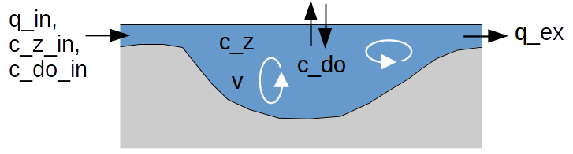

<!--
%\VignetteEngine{knitr::knitr}
%\VignetteIndexEntry{Using rodeo}
-->

# When to use this package
The *rodeo* package facilitates the implementation of ODE-based models. These are models that describe the dynamics of a set of *n* state variables by integrating a set of *n*  ordinary differential equations. The package is particularly useful in conjunction with the [deSolve](http://cran.r-project.org/web/packages/deSolve/index.html) package providing numerical solvers for initial value problems.

The advantages from using *rodeo* are:

 - You can define the model using just plain tabular text files. Thus, the model is formulated independent from source code. Mathematical expressions and documentation form a unit.
 
 - You are forced to provide the model in stoichiometry matrix notation (see [here](http://en.wikipedia.org/wiki/Petersen_matrix)). If you do not see the advantage, read on.
 
 - You can visualize the structure of the model by plotting the stoichiomety matrix.
 
 - Due to use of the matrix notation, redundant terms are eliminated from the differential equations. This contributes to comprehensibility and increases computational efficiency.
 
 - You can generate source code for different target languages. At the moment, *R* and *Fortran95* are supported.
 
 - The generated source code is applicable to an arbitrary number of boxes (control volumes). This allows for simulating spatially distributed systems. Using  the [method-of-lines](http://en.wikipedia.org/wiki/Method_of_lines) approach one can easily build reactive transport models.


# Example problem
The functioning of the package is best illustrated by an example. In this document, we consider a continuous flow stirred tank reactor (CFSTR) containing a degradable organic matter (concentration *c_z*) and dissolved oxygen (*c_do*). Due to mixing, the reactors contents is spatially homogeneous, hence the concentrations are scalars (see figure below). Changes in concentrations are triggered by

  (1) the loads in the reactor's inflow
  (2) aerobic degradation of the organic matter (1st order) which consumes dissolved oxygen
  (3) exchange of oxygen with the atmosphere

Some specific aspects of the model are as follows:

  - The dependence of aerobic degradation on available oxygen is described with a Monod term (Michaelis-Menten model).
  - The rate of oxygen exchange between water and atmosphere is described as an empirical function of water depth and wind speed.
  - The model does *not* assume steady flow conditions, hence the volume of the reactor is a state variable too.



Using *rodeo*, the model can be described using just tabular text files. These files are shipped with the package (see below).

*Declaration of identifiers (data set `identifiers`). The type column indicates whether the item is a state variable (v), a parameter (p), or a function (f).*

```{r exampleData1, echo=FALSE}
library(rodeo, quietly=TRUE)
data(identifiers)
print(format(identifiers, justify="left"))
```

*Tab. 2: Specification of processes (data set `processes`).*
```{r exampleData2, echo=FALSE}
data(processes)
print(format(processes, justify="left"))
```

*Tab. 3: Specification of stoichiometric factors (data set `stoichiometry`).*
```{r exampleData3, echo=FALSE}
data(stoichiometry)
print(format(stoichiometry, justify="left"))
```

# Basic use

## Creating and inspecting a model object

We start by creating a new object with `new()`. This requires us to supply the name of the class as well as a set of data frames for initialization.

```{r createObj}
library(rodeo, quietly=TRUE)

# Load sample data frames (contents shown above)
data(identifiers, processes, stoichiometry)

# Instantiate new object
model= new("rodeo", vars=subset(identifiers,type=="v"),
  pars=subset(identifiers,type=="p"), funs=subset(identifiers,type=="f"),
  pros=processes, stoi=stoichiometry)
```

To inspect the object's contents, we can use the following:
```{r inspectObj, eval=FALSE}
# Built-in method
model$show()

# Show stoichiometry information as a matrix
print(model$stoichiometry())
```

Finally, one can use e.g. `exportDF` to export the object's basic information in a format which is suitable for inclusion in HTML or TEX documents. The example below illustrates how information on state variables can be exported as TEX code.

```{r exportTables, eval=TRUE}
# Select columns to export
df= model$getVars()[,c("tex","unit","description")]
# Define formatting functions
bold= function(x){paste0("\\textbf{",x,"}")}
mathmode= function(x) {paste0("$",x,"$")}
# Export
tex= exportDF(x=df, tex=TRUE,
  colnames=c(tex="symbol"),
  funHead=setNames(replicate(ncol(df),bold),names(df)),
  funCell=list(tex=mathmode)
)
cat(tex)
```

Alternatively, a markdown compatible dataframe can be generated and used with the knitr function kable. This will work with html, pdf or even Word (.docx) output. Thanks to Andrew Dolman for this example.

```{r knitrTables}
to_markdown <- function(dat, which_cols){
  cols <- which(names(dat) %in% which_cols)
  for(i in cols){
    dat[, i] <- ifelse(dat[, i] != "", paste0("$", dat[, i], "$"), "")
    }
  return(dat)
} 

ids <- model$getVars()[,c("tex", "unit", "description")]
names(ids) <- c("Symbol", "Unit", "Description")
kable(to_markdown(ids, which_cols=c("Symbol"))
      , caption = "State variables")
```

## Defining functions and supplying data

In order to work with the object, we need to define functions that are referenced in the model's mathematical expressions. This includes the forcings which are functions of a special argument with the reserved name 'time'. See the [section on forcings](#forcings) for details.

```{r setFuns}
# 'normal' functions
O2sat= function(t) {14.652 - 0.41022*t + 0.007991*t^2 - 0.000077774*t^3}
ka= function(u, d) {(0.728*sqrt(u) - 0.317*u + 0.0372*u^2) / d / 86400}
monod= function(s,h) {s / (s + h)}
# forcings are functions of special variable 'time'
c_z_in= function(seconds) { 0.1 * seconds/(7*86400 + seconds) }
c_do_in= function(seconds) { 9.022 }
```

We also need to set the values of parameters and state variables (initial values). We first define both parameters and initial values as lists. These lists are then coerced into named vectors using the dedicated methods `arrangePars()` and `arrangeVars()`. Use of these methods guarantees that the vector elements appear in proper order. Proper order is essential when the vector elements are accessed *by position* rather than *by name*.

```{r setData}
pars= list(kd=5.78e-7, h_do=0.5, s_do_z=2.76, wind=1, depth=2,
 temp=20, q_in=1, q_ex=1)
vars= list(c_z=1, c_do=9.022, v=1.e6)
p= model$arrangePars(pars)
v= model$arrangeVars(vars)
```

## Computing and visualizing the stoichiometry matrix

Having defined all functions and having set the values of variables and parameters, one can compute the stoichiometry factors.

```{r stoiCompute, eval=TRUE}
m= model$stoichiometry(c(v, p, time=0))
print(signif(m, 3))
```

For presentations, it is often a good idea to replace the numeric values by symbols encoding the sign of the stoichiometry factors. The following example generates suitable HTML code. In order to test this, you need to

 - create a new text file with the extension '.html'
 - copy the output to this file and remove the '##' characters
 - enclose the files contents by `<html>` and `</html>`
 - open the file in a web browser

```{r stoiSymbols, eval=TRUE}
signsymbol= function(x) {
  if (as.numeric(x) > 0) return("&#9651;")
  if (as.numeric(x) < 0) return("&#9661;")
  return("")
}
tbl= cbind(data.frame(process=rownames(m), stringsAsFactors=FALSE), as.data.frame(m))
cat(exportDF(x=tbl, tex=FALSE,
  colnames= setNames(c("Process",model$getVars()$html[match(colnames(m),
    model$getVars()$name)]), names(tbl)),
  funCell= setNames(replicate(ncol(m),signsymbol), colnames(m))
))
```
A markdown compatible version looks like this (contributed by Andrew Dolman):

```{r markdownStoic}
signsymbol= function(x) {
  if (as.numeric(x) > 0) return("$\\blacktriangle$")
  if (as.numeric(x) < 0) return("$\\blacktriangledown$")
  return("")
}

stoi_mat <- model$stoichiometry(c(v, p, time=0))
stoi_mat <- data.frame(apply(stoi_mat, MARGIN = c(1, 2), signsymbol))
stoi_mat <- setNames(stoi_mat, paste0("$", model$getVars()$tex[match(colnames(stoi_mat), model$getVars()$name)], "$"))
stoi_mat <- cbind(Process=rownames(stoi_mat), stoi_mat)

kable(stoi_mat, row.names = FALSE, caption = "Stoichiometric matrix")
```

## Translating the model into source code

In order to use the model for simulation, we need to transfer it into source code. This is also known as 'code generation'. Specifically, we want the code generator to create a function that returns the derivatives of the state variables with respect to time. In addition to the derivatives, the generated function also returns the values of all process rates (as diagnostic variables).

After generating the code, we need to make it executable. In R, we can use a combination of `eval()` and `parse()`. Alternatively, the generated code could be for loaded with `source()` after exporting it to a file (e.g. using `write()`). The latter method is needed if one wants to inspect (or even modify) the generated code.

```{r generateR}
code= model$generate(name="derivs",lang="r")
derivs= eval(parse(text=code))
```

## Solving the ODE system

Now we are ready to compute the evolution of the state variables over time by means of numerical integration. At this point, the proper order of the elements in the vectors `v` and `p` is essential since the generated function code uses *by-index* access! Therefore, `v` and `p` should always be set by calls to the `arrangeVars()` and `arrangePars()` method, respectively.

In addition to the dynamics of the state variables, we also get the dynamics of the process rates.

```{r solve-0d}
library(deSolve)
t= seq(0, 30*86400, 3600)
out= ode(y=v, times=t, func=derivs, parms=p, NLVL=1)
layout(matrix(1:8, ncol=4, byrow=TRUE))
plot(out, mfrow=NULL)
```

# Advanced topics

## Handling spatially distributed systems

A zero-dimensional case (single reactor) has been considered so far. We will now extend the model for multiple spatial levels, i.e. for a collection of (isolated) reactors.

First, we need to provide vectors (instead of scalars) for one variable and one parameter, at least. Variables and parameters with scalar values will be replicated to vectors of the required length. In the example, we initialize every modeled reactor with a different concentration of organic matter.

Second, we need to pass the actual number of reactors to the derivatives function in the `NLVL` argument.

```{r solve-1d, fig.width=8, fig.height=3}
nbox= 3
pars= list(kd=rep(5.78e-7, nbox), h_do=0.5, s_do_z=2.76, wind=1, depth=2,
  temp=20, q_in=1, q_ex=1)
vars= list(c_z=seq(from=0, to=50, length.out=nbox), c_do=9.022, v=1.e6)
p= model$arrangePars(pars)
v= model$arrangeVars(vars)

out= ode(y=v, times=t, func=derivs, parms=p, NLVL=nbox)
layout(matrix(1:nbox, nrow=1))
plot(out, which=paste("c_do",1:nbox,sep="."), mfrow=NULL)
```

## Definition of models in Fortran (instead of R)

Real-world models usually consist of many and lenghty mathematical expressions. Also, depending on the studied problem, the ODE solver may need to use (very) short time steps. Then, computation times become of serious concern. In those time-critical cases, it is recommended to generate source code for a fast, compilable language rather than for (slower) R. The compilable language currently supported by the package is *Fortran95*.

The next statement generates *Fortran95* code and exports it to a file for later compilation.
```{r generateF}
code= model$generate(name="derivs",lang="f95")
file_genCode= paste0(gsub("\\","/",tempfile(),fixed=TRUE), ".f95")
write(x=code, file=file_genCode)
cat("code written to",file_genCode)
```

Inspection of the generated *Fortran95* code reveals that the interface of the central subroutine "derivs" is

`subroutine derivs(time, var, par, NLVL, dydt, pro)`

However, according to the [vignette of the *deSolve* package](http://cran.r-project.org/web/packages/deSolve/vignettes/compiledCode.pdf) (page 6), the following interface is required

`subroutine derivs (neq, t, y, ydot, yout, ip)`

and an additional subroutine for parameter initialization (`initmod`) must to be supplied as well.

Consequently, we need to provide the following Fortran code

  (1) a wrapper around the generated function to make its interface compatible with *deSolve*
  (2) the additional subroutine for parameter initialization
  (3) any functions used by the model

A suitable Fortan code for (1) and (2) can be generated by the function call 'solverInterface(NLVL)' where the integer argument `NLVL` specifies the desired number of spatial levels (default 1). The generated wrapper and initialization code for the considered case is shown below. For later use by a compiler, the generated code must be written to disk.

```{r fortranWrapper, echo=TRUE}
# Create and show wrapper code
fwrap= solverInterface(nbox, "derivs")
cat(fwrap)

# Export wrapper code to file for later compilation
file_auxCode= paste0(gsub("\\","/",tempfile(),fixed=TRUE), ".f95")
write(fwrap, file_auxCode)
```

The model-specific functions (3) could be defined as :

```{r fortranFunctions, echo=FALSE}
file_funCode= "functionsCode.f95"
text= readLines(file_funCode, n=-1L, ok=TRUE, warn=TRUE, encoding="unknown", skipNul=FALSE)
text= paste(text,"\n")
cat(text)
```

As a next step, we need to compile *(a)* the generated code and *(b)* all hand-written auxiliary code (boxes above) into a shared library. For that purpose, we make use of R's command line utility `R CMD SHLIB`. The 3 files passed to the command are the following:
  
  - *file_funCode* : Hand-coded source file with the model-specific function (box above)
  - *file_auxCode* : Source file containing the wrapper and dimension specifications (box above)
  - *file_genCode* : File containing the generated source

```{r compileF, echo=TRUE}
dllname= "mySharedLib"
dllfile= paste0(dllname,.Platform$dynlib.ext)
command= paste0("R CMD SHLIB ",file_funCode," ",file_genCode," ",file_auxCode,
  " --preclean --clean -o ",dllfile)
if (system(command) != 0)
  stop(paste0("Error running '",command,"'"))
```

```{r, echo=FALSE}
# Clean up files from compilation
invisible(file.remove(list.files(pattern=".+[.]mod")))
```

We are now prepared to load the shared library and run the simulation based on the Fortran code. Note the additional arguments `dllname`, `initfunc`, and `nout` being passed to the numerical solver (use `?lsoda` to see the documentation for them). Note that setting a wrong value for `nout` easily makes R  crash.

```{r solve-1d-F, fig.width=8, fig.height=3}
dyn.load(dllfile)
out= ode(y=v, times=t, func="derivs_wrapped", parms=p, NLVL=nbox,
  dllname=dllname, initfunc="initmod", nout=model$lenPros()*nbox)
layout(matrix(1:nbox, nrow=1))
dyn.unload(dllfile)
plot(out, which=paste("c_do",1:nbox,sep="."), mfrow=NULL)
```

```{r, echo=FALSE}
# Clean up dll file
invisible(file.remove(list.files(pattern=paste0(".+",.Platform$dynlib.ext))))
```

## Forcings

### Two alternative options
In general, there are two options for dealing with time-variable forcings:

 - *functions-of-time*: In this approach one needs to define the forcings as functions of a single argument representing time. In `rodeo` this argument must have the reserved name 'time'. Use of this approach is most convenient if the forcings are easily described as parametric functions of time (e.g. seasonal change of solar radiation). It can also be used with tabulated time series data, but this requires some extra coding. In any case, it is essential for rescrict the integration step size of the solver (e.g. using the `hmax` argument of `deSolve::lsoda`) so that short-term variations in the forcings cannot be 'missed'.
 
 - *stop-and-go*: In this approach forcings are implemented as normal parameters. To allow for their variation in time, the ODE solver is interrupted every time when the forcing data change. The solver is then re-started with the updated parameters (i.e. forcing data) using the states computed in the previous call as initial values. Hence, the calls to the ODE solver must be embedded within a time-loop. With this approach, setting a limit on the solver's integration step size (through argument `hmax`) is not required since the solver is interrupted at the 'critical times' anyway.

In real-world applications, the 'stop-and-go' approach is often simpler to use and the overhead due to interruption and re-start of the solvers seems to be rather small. It also facilitates the generation of useful traceback information in case of exceptions (e.g. due to corrupt time series data).

### Using the 'functions-of-time' approach with Fortran-based models

This section demonstrates how the 'functions-of-time' approach can be used in Fortran-based models assuming that information on forcings is stored in delimited text files. Such files can be created, for example, with any spreadsheet software, data base system, or R. Assume that we have time series of two meteorological variables exported to a text file 'meteo.txt':

```{r meteoData, echo=TRUE}
dat= data.frame(time=1:10, temp=round(rnorm(n=10, mean=20, sd=3)), humid=round(runif(10)*100))
write.table(x=dat, file="meteo.txt", col.names=TRUE, row.names=FALSE, sep="\t", quote=FALSE)
print(dat)
```

We can now use `forcingFunctions` to generate the  appropriate forcing function in Fortran. In this example, we request linear interpolation via the method's `mode` argument. Note that the lengthy path names after the `include` statements point to files in `rodeo`'s installation folder, thus, the names don't require manual adaption.

```{r forcingFunctions, echo=TRUE, eval=TRUE}
dat= data.frame(name=c("temp","humid"), column=c("temp","humid"), file="meteo.txt", mode=-1)
code= forcingFunctions(dat)
write(x=code, file="forc.f95")
cat(code)
```

The following Fortran code demonstrates how the user-defined forcing functions can be tested/debugged outside of the `rodeo` environment. The shown utility program can be compiled, for example, using a command like `gfortran <file_with_generated_module> <file_with_program> -o test`. Note that the subroutines `rwarn` and `rexit` are available automatically if the code is used to build a shared library with `R CMD SHLIB`, i.e. the subroutine must not be defined.

```{r fortranForcingsTest, echo=FALSE}
text= readLines("fortranForcingsTest.f95", n=-1L, ok=TRUE, warn=TRUE, encoding="unknown", skipNul=FALSE)
text= paste(text,"\n")
cat(text)
```
# Short guide on writing `rodeo`-compatible Fortran functions

## Reference example

As a reference, the following example code can be used which declares a function of two arguments. Comments have been added to explain the individual statements. In Fortran, comments are generally initiated with the exclamation mark (!). They may appear right after statements or on separate lines.

```
1  double precision function FUNCNAME (ARG1, ARG2) ! declare the function
2  implicit none                                   ! force declarations
3  double precision, intent(in):: ARG1, ARG2       ! declare argument(s)
4  double precision:: LOCAL                        ! declare local variable(s)
5  double precision, parameter:: CONST=1.d0        ! declare local constant(s)
6  LOCAL= ARG1 * CONST + ARG2                      ! any local computation(s)
7  FUNCNAME= LOCAL                                 ! set return value
8  end function                                    ! closes the function
```
For compatibility with `rodeo`, the function result must be a scalar of type `double precision` (a floating point number of typically 8 byte). There are several ways to achieve this but the simplest and recommended syntax is put the type declaration `double precision` right before the function's name (line 1). Then, the return value must be set by an assignment to the function's name (line 7). This is best done at a single location in the body code, typically at the very end.

It is a good habit to always put `implicit none` in the first line of the function body (line 2). This is to disable so-called implicit typing (a rather dangerous technique of automatic data type assignment). With this statement, all arguments (line 3) and local variables or constants (lines 4 and 5) need to be explicitly declared. The repetition of the argument's names in lines 1 and 3 may be a bit annoying (but one can use copy and paste). All declarations need to be made at the top of the function's body (right after the `implicit none`) before any other statements.

In Fortran, identifier names are not case-sensitive (as opposed to R). This applies to the name of the function itself as well as to the names of arguments and local variables or parameters.

Note: It is actually sufficient to use the `implicit none` statement at the beginning of the module that contains all function declarations. Repetition of the statement in the individual functions does not do any harm, however. 

## Common pitfalls

### Double precision variables and constants

Fortran has several types to represent floating point numbers that vary in precision but `rodeo` generally uses the type `double precision`. Thus, any local variables and parameters should also be declared as `double precision`. To declare a numeric constant of this type, e.g. `pi`, one needs to use the syntax `3.1415d0`, i.e. the conventional 'e' in scientific notation is replaced by 'd'. An alternative but less portable syntax exists but it is not mentioned here.

```
double precision, parameter:: pi= 3.1415d0, e= 2.7183d0   ! math constants 
double precision, parameter:: kilograms_per_gram = 1.d-3  ! 1/1000
double precision, parameter:: distance_to_moon = 3.844d+5 ! 384400 km
```

Note the `parameter` keyword used to inform the compiler that the declared item(s) are constants rather than variables.

### Integers in numeric expressions

It is recommended to avoid integers in arithmetic expressions as the result may be unexpected. Use `double precision` constants instead of `integer` constants or, alternatively, explicitly convert `integer` constants to `double precision` by means of the `dble` intrinsic function.

```
average= (value1 + value2) / 2d0       ! does not use an integer at all
average= (value1 + value2) / dble(2)   ! explicit type conversion
```

It is often even better not to use any literal constants, leading to a code like

```
double precision, parameter:: TWO= 2.d0
! possibly other statements
average= (value1 + value2) / TWO
```

Using uppercase names for constants is a widespread habit but this is a matter of style only.

### Continuation lines

Source code lines should not exceed 80 characters (though some compilers support longer lines). If an expression does not fit on a single line, the ampersand (&) must be used to indicate continuation lines. It is recommended to put the & at the end of any unfinished line as in the following example:

```
a = term1 + term2 + &
    term3 + term4 + &
    term5
```

Missing & characters are a frequent cause of compile time errors sometimes being rather obscure.

## More information

The [Fortran Wiki](http://fortranwiki.org/fortran/show/HomePage) is a good source of additional information, providing links to standard documents, books, etc.
