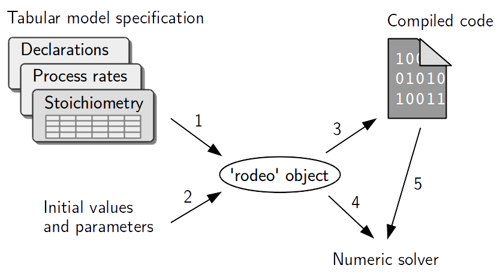
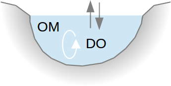
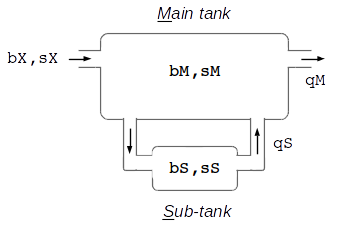
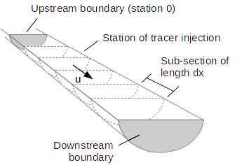
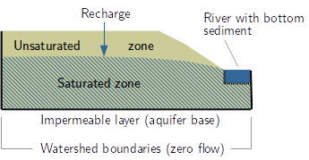
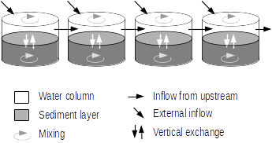
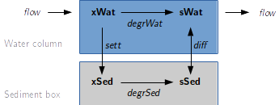

<!-- ALTERNATIVE FOR HTML
  rmarkdown::html_document:
    number_sections: yes
    toc: yes
    toc_depth: 3
    toc_float: true
-->

```{r, echo=FALSE}
# Store output format for later use
options(vignetteDocumentFormat= rmarkdown::all_output_formats("rodeoVignette.Rmd"))
```


```{r echo=FALSE}
options(width=120) 
library(xtable)
options(xtable.caption.placement = 'top',
        xtable.include.rownames = FALSE,
        xtable.comment = FALSE,
        xtable.booktabs = TRUE
  )
```

<style>
  .htmlTableBackground table {
    background-color:#F3F4E3;
    font-family: monospace;
    font-size: 90%;
  }
</style>

# Main features of `rodeo`

The `rodeo` package facilitates the implementation of ODE-based models in R. Such models describe the dynamics of a system with a set simultaneously differential equations. The package is particularly useful in conjunction with the R packages [`deSolve`](http://cran.r-project.org/package=deSolve) and [`rootSolve`](http://cran.r-project.org/package=rootSolve) providing numerical solvers for initial-value problems and steady-state estimation. The functionality of `rodeo` is summarized in the following figure. 



1: Instantiation of a `rodeo` object from a table-based model specification.
2: Assignment of numeric data through the object's `set` methods.
3: Automatic code generation and compilation / interpretation.
4: Access to numeric data through the object's `get` methods.
5: Access to functions.

The specific advantages from using `rodeo` are:

- The model is formulated independent from source code to facilitate portability, re-usability, and documentation. Specifically, the model has to be set-up using the well-established [Peterson matrix notation](http://en.wikipedia.org/wiki/Petersen_matrix). All ingredients of a model (i. e. the ODE's right hand sides, declarations, and documentation) are in tabular form and they can be imported from delimited text files or spreadsheets.

- Owing to the matrix notation, redundant terms are largely eliminated from the differential equations. This contributes to comprehensibility and increases computational efficiency. The stoichiometry matrix can also be visualized to better communicate the model to other modelers or end users.

- `rodeo` provides a code generator which supports R and Fortran as target languages. Using compiled Fortran can speed up numerical integration by 1 or 2 orders of magnitude (compared to plain R).

- Code can be generated for an arbitrary number of computational boxes (e. g. control volumes in a spatially discretized model). This allows even partial differential equations (e. g. reactive transport problems) to be tackled after appropriate semi-discretization. The latter strategy is known as the [method-of-lines](http://en.wikipedia.org/wiki/Method_of_lines).

# Basic use

## Example ODE system {#exampleODE}

In the subsequent sections, the package's functioning is illustrated with a simple model of bacteria growth in a continuous flow stirred tank reactor (figure below). It is assumed that the bacteria grow on a single resource (e. g. a source of organic carbon) which is imported via the reactor's inflow. Due to mixing, the reactors contents is spatially homogeneous, hence the density of bacteria as well as the concentration of the substrate are scalars.


Changes in bacteria density are due to (1) resource-limited growth and (2) wash-out from the reactor (inflow is assumed to be sterile). The substrate concentration is controlled by (1) the inflow as well as (2) the consumption by bacteria. A classical Monod term was used to model the resource dependency of bacteria growth. For the sake of simplicity, the external forcings (i. e. flow rate and substrate load) are held constant and the reactor's volume is a parameter rather than a state variable.

The governing differential equations are

$$ \frac{d}{d t}bac = \color{blue}{mu \cdot \frac{sub}{sub+half} \cdot bac} + \color{red}{\frac{flow}{vol}} \cdot (0-bac) $$

$$ \frac{d}{d t}sub = -\frac{1}{yield} \cdot \color{blue}{mu \cdot \frac{sub}{sub+half} \cdot bac} + \color{red}{\frac{flow}{vol}} \cdot (sub_{in}-sub) $$


where redundant terms are displayed in identical colors (all identifiers are explained in tables below). For use with `rodeo`, the equations must be split up into a vector of process rates ($r$) and a matrix of stoichiometric factors ($S$) so that the product of the two yields the vector of the state variables' derivatives with respect to time ($\dot{y}$). Note that

$$
\dot{y} = r \cdot S
$$

is the same as

$$
\dot{y} = S^T \cdot r
$$

In the first form, $\dot{y}$ and $r$ are row vectors. In the second form which involves the transpose of $S$, $\dot{y}$ and $r$ are column vectors. Adopting the first form, the above set of ODE can be written as

$$
\begin{bmatrix} \dfrac{d}{d t}bac & \dfrac{d}{d t}sub \end{bmatrix} =
\begin{bmatrix} mu \cdot \dfrac{sub}{sub+half} \cdot bac & \dfrac{flow}{vol} \end{bmatrix} \cdot
\begin{bmatrix} 1 & -bac \\ -\dfrac{1}{yield} & sub_{in}-sub \end{bmatrix}
$$

The vector $r$ and the matrix $S$, together with a declaration of all identifiers appearing in the expressions, can conveniently be stored in tables, i.e. R data frames. Appropriate data frames are shipped with the package and can be loaded with the R function `data`. Their contents is displayed below:

<div class='htmlTableBackground'>
```{r, echo=FALSE}
library(rodeo)
data(vars, pars, funs, pros, stoi)
knitr::kable(vars, caption="Data set `vars`: Declaration of state variables.")
knitr::kable(pars, caption="Data set `pars`: Declaration of parameters.")
knitr::kable(funs, caption="Data set `funs`: Declaration of functions referenced at the ODE's right hand sides.")
knitr::kable(pros, caption="Data set `pros`: Definition of process rates.")
knitr::kable(stoi, caption="Data set `stoi`: Definition of stoichiometric factors providing the relation between processes and state variables. Note the (optional) use of a tabular layout instead of the more common matrix layout.")
```
</div>

## Creating a `rodeo` model object

We start by loading packages and the example data tables whose contents was shown in the above tables.

```{r loadExampleData, echo=TRUE}
rm(list=ls())     # Initial clean-up
library(deSolve)
library(rodeo)
data(vars, pars, pros, funs, stoi)
```

Then, a new object is created with the `new` method of the R6 class system. This requires us to supply the name of the class, data frames for initialization, as well as the spatial dimensions. Here, we create a single-box model (one dimension with no subdivision).

```{r initSingleBox, echo=TRUE}
model <- rodeo$new(vars=vars, pars=pars, funs=funs,
  pros=pros, stoi=stoi, dim=c(1))
```

To inspect the object's contents, we can use the following:

```{r inspectObject, echo=TRUE, eval=FALSE}
print(model)                   # Displays object members (output not shown)
print(model$stoichiometry())   # Shows stoichiometry as a matrix
```

## Defining functions and assigning data

In order to work with the object, we need to define functions that are referenced in the process rate expressions or stoichiometric factors (i. e. the ODEs' right hand sides). For non-autonomous models, this includes the definition of forcings which are functions of a special argument with the reserved name 'time' (details follow in a [separate section on forcings](#forcings)).

For the bacteria growth example, we only need to implement a simple [Monod function](https://en.wikipedia.org/wiki/Monod_equation).

```{r defNormalFunctions, echo=TRUE, eval=TRUE}
monod <- function(c, h) { c / (c + h) }
```

We also need to assign values to parameters and state variables (initial values) using the dedicated class methods `setPars` and `setVars`. Since we deal with a single-box model, parameters and initial values can be stored in ordinary *named* vectors.

```{r dataSingleBox, echo=TRUE, eval=TRUE}
model$setVars(c(bac=0.01, sub=0))
model$setPars(c(mu=0.8, half=0.1, yield= 0.1, vol=1000, flow=50, sub_in=1))
```

## Computing the stoichiometry matrix

Having defined all functions and having set the values of variables and parameters, one can compute the stoichiometric factors. In general, explicitly computing these factors is not necessary, it may be helpful in debugging however. To do so, the `stoichiometry` class method needs to be supplied with the index of the spatial box (only relevant for multi-box models) as well as the time of interest (in the case of non-autonomous models).

```{r showNumericStoi, echo=TRUE, eval=TRUE}
m <- model$stoichiometry(box=1, time=0)
print(signif(m, 3))
```

The stoichiometry matrix is also a good means to communicate a model because it shows the interactions between processes and variables in a concise way. How the stoichiometry matrix can be visualized graphically is demonstrated in a [dedicated section](#visualizeStoichiometry) below.

## Generating source code for numerical solvers

In order to use the model for simulation, we need to generate source code to be passed to numerical solvers. Specifically, the generated function code shall return the derivatives of the state variables with respect to time plus additional diagnostic information (here: the process rates).

In this example, R code is generated (Fortran code generation is described [elsewhere](#fortranGeneration)). The R code is not 'compiled' in a strict sense but it is made executable through a combination of the functions `eval` and `parse`.

```{r generateSingleBoxR, echo=TRUE, eval=TRUE}
model$compile(fortran=FALSE)
```

## Numerical integration

We are now ready to compute the evolution of the state variables over time by means of numerical integration. The call below employs the `ode` function from package `deSolve`.

```{r solveSingleBoxR, echo=TRUE, eval=FALSE, results='hide'}
out <- model$dynamics(times=0:96, fortran=FALSE)
plot(out)  # plot method for 'deSolve' objects
```

The graphical output of the above code is displayed below (top row: state variables, bottom row: process rates).

```{r ref.label='solveSingleBoxR', echo=FALSE, eval=TRUE}
```

# Advanced topics

## Multi-box models {#multi-box}

### Characteristics and use of multi-box models

Imagine a multi-box model like a vector of ODE models. In case of the [example considered so far](#exampleODE), a multi-box model would simulate bacteria growth in series of tanks (whereas the single-box version describes just a single tank). The important point is that, in a multi-box model, the ODE system to be solved is the same in each box (but parameters can vary from box to box). This distinguishes *multi-box* models from *multi-object* models introduced in [a later section](#multiObjectModels).

For multi-box models, there must be a convention regarding the layout of arrays used to store the values of variables, parameters, and process rates. In conjunction with the method-of-lines, it is desireable to (1) store the values of a particular variable, parameter, or rate in a contiguous array section and (2) store the data of neighboring boxes as neighboring array elements. For example, in a 1-dimensional multi-box model with 3 boxes and two state variables A and B, the layout of the states vector is A.1, A.2, A.3, B.1, B.2, B.3 (instead of A.1, B.1, A.2, ...). Thus, the index of the box varies faster than the index of the variable. Note that the same convention automatically applies to the output of the numerical solvers, i. e. the columns of the output matrix returned from the [`deSolve`](http://cran.r-project.org/package=deSolve) methods are ordered as just described.

There are two main areas of use for multi-box models:

1. They can be used, for example, to model an array of experiments, where the individual  experiments different in parameters or initial values. In such a case the boxes **do not interact**, i.e. the dynamics in a particular box is from the dynamics in the other boxes.

2. Multi-box models can also be used to represent ODE systems originating from semi-discretization of partial differential equations. This approach, better known as the [method-of-lines](http://en.wikipedia.org/wiki/Method_of_lines) (MOL), is applicable to reactive transport problems, for example. In such a case, neighboring boxes do **interact** with each other.

Examples for these two cases are provided below.

### Non-interacting boxes

This example applies the [bacteria growth model](#exampleODE) to two tanks, the latter being *independent* of each other. We start from a clean environment.

```{r ref.label='loadExampleData', echo=TRUE, eval=TRUE}
```

First of all, we need to create a model object with the appropriate number of dimensions and the desired number of boxes in each dimension. These values are specified in the `dim` argument of `rodeo`'s initialization method. Here, we request the creation of two boxes in the first and only dimension.

```{r initMultiBox, echo=TRUE, eval=TRUE}
nBox <- 2
model <- rodeo$new(vars=vars, pars=pars, funs=funs,
  pros=pros, stoi=stoi, dim=c(nBox))
```

Second, the function returning the state variables' derivatives needs to be re-generated to reflect the altered number of boxes.
 
```{r generateMultiBoxR, echo=TRUE, eval=TRUE}
model$compile(fortran=FALSE)
```
```{r ref.label='defNormalFunctions', echo=TRUE, eval=TRUE}
```

Third, initial values and parameters need to be specified as arrays now (instead of vectors) because the values can vary from box to box. For a multi-box model with a single spatial dimension, we must use matrices (being two-dimensional arrays) whose column names represent the names of variables or parameters, respectively. The matrix row with index $i$ provides the respective values for the model's $i$-th box.

In this example, the two reactors only differ in their storage capacity (parameter `vol`). All other parameters and the initial concentrations of substrate and bacteria are kept identical.
 
```{r dataMultiBox, echo=TRUE, eval=TRUE}
rp <- function (x) {rep(x, nBox)}    # For convenient replication
v <- cbind(bac=rp(0.01), sub=rp(0))
model$setVars(v)
p <- cbind(mu=rp(0.8), half=rp(0.1), yield= rp(0.1),
  vol=c(300, 1000), flow=rp(50), sub_in=rp(1))
model$setPars(p)
```

Finally, the integration method is called as usual.

```{r solveMultiBoxR, echo=TRUE, eval=TRUE}
out <- model$dynamics(times=0:120, fortran=FALSE)
```

The dynamics of the state variables in all boxes are conveniently plotted with `matplot`. Note that the box index is appended to the state variables' names and the two parts are separated by a period. For example, the bacteria density in the first box is found in column 'bac.1' of the matrix `out`.

```{r plotMultiBox, echo=TRUE, eval=TRUE, fig.show='hold', fig.height=4}
layout(matrix(1:model$lenVars(), nrow=1))
for (vn in model$namesVars()) {
  matplot(out[,"time"], out[,paste(vn, 1:nBox, sep=".")],
    type="l", xlab="time", ylab=vn, lty=1:nBox, col=1:nBox)
  legend("right", bty="n", lty=1:nBox, col=1:nBox, legend=paste("box",1:nBox))
}
layout(1)
```

### Interacting boxes

In this context, *interaction* means that the state variables' derivatives in a box $i$ depend on the state of another box $k$. This is typically the case if advection or diffusion-like processes are simulated because fluxes between boxes (e.g. of mass or heat) are driven by spatial gradients.

`rodeo`'s support for interactions between boxes is currently limited to models with a single dimension (1D models). Also, interaction is possible between *adjacent* boxes only (but not between, e.g., boxes $i$ and $i+2$).

The key to the simulation of interactions is that each box can query the values of state variables (or parameters) in the adjacent boxes. This functionality is implemented through the pseudo-functions 'left' and 'right'. These can be used in the mathematical expressions forming the ODE's right hand sides. The functions do what their names say. For example, if 'x' is a state variable, the expression `x - left(x)` yields the difference between the value in the current box (index $i$) and the value in adjacent box $i-1$. Likewise, `x - right(x)` is used to calculate the difference between the current box (index $i$) and box $i+1$.

The two pseudo-functions must behave specially at the model's boundaries. In other words, it has to be defined what `left(x)` returns for the leftmost box (index $1$) and what `right(x)` returns for the box with the highest index. The convention is simple: If the index would go out of bounds, the functions return the respective value for the current cell. See the table below for clarification.

```{r echo=FALSE}
x <- rbind(
 c("1", "x.1", "x.2"),
 c("2", "x.1", "x.3"),
 c("3", "x.2", "x.4"),
 c("4", "x.3", "x.5"),
 c("5 (highest index)", "x.4", "x.5")
)
colnames(x) <- c("Box index","left(x) returns","right(x) returns")
knitr::kable(as.data.frame(x, check.names=FALSE))
```

This behaviour of 'left' and 'right' at the models boundaries is often convenient. Consider, for example, a model of advective transport using the backward finite-difference approximation `u/dx * (left(c) - c)` ('u': velocity, 'c': concentration, 'dx': box width). For the leftmost box, the whole term equates to zero since both `c` and `left(c)` point to the concentration in box $1$.

Imposing boundary conditions on the leftmost box (index $1$) and the righmost box (highest index) is fairly simple. First, the required term(s) are simply added to the process rate expressions. Second, the term(s) are multiplied with a mask parameters that take a value of 1 at the desired boundary and 0 elsewhere. In the just mentioned advection example, a resonable formulation could be

`u/dx * (left(c) - c) + leftmost(2 * u/dx * (cUp - c))`

where `cUp` is the concentration just upstream of the model domain, and `leftmost` is the mask parameter being set to one for the leftmost box and zero for all other boxes.

Interaction between boxes is demonstrated with a minimum example. It extends the above 'no-interaction' example case by introduction of a diffusive flux of substrate between the two tanks.

The original model is first loaded and then extended for the new process.

```{r ref.label='loadExampleData', echo=TRUE, eval=TRUE}
```

```{r alterExampleData, echo=TRUE, eval=TRUE}
pars <- rbind(pars,
  c(name="d", unit="1/hour", description="diffusion parameter")
)
pros <- rbind(pros,
  c(name="diffSub", unit="mg/ml/hour", description="diffusion of substrate",
    expression="d * ((left(sub)-sub) + (right(sub)-sub))")
)
stoi <- rbind(stoi,
  c(variable="sub", process="diffSub", expression="1")
)
```

The following code sections are the same as for the 'no-interaction' case.

```{r ref.label='initMultiBox', echo=TRUE, eval=TRUE}
```

```{r ref.label='generateMultiBoxR', echo=TRUE, eval=TRUE}
```

```{r ref.label='defNormalFunctions', echo=TRUE, eval=TRUE}
```

A value must be assigned to the newly introduced diffusion parameter `d` as well.

```{r dataMultiBoxInteracting, echo=TRUE, eval=TRUE}
rp <- function (x) {rep(x, nBox)}    # For convenient replication
v <- cbind(bac=rp(0.01), sub=rp(0))
model$setVars(v)
p <- cbind(mu=rp(0.8), half=rp(0.1), yield= rp(0.1),
  vol=c(300, 1000), flow=rp(50), sub_in=rp(1),
  d=rp(.75))                          # Added diffusion parameter
model$setPars(p)
```

The code for integration and plotting is the same as for the 'no-interaction' case. 

```{r ref.label='solveMultiBoxR', echo=TRUE, eval=TRUE}
```

```{r ref.label='plotMultiBox', echo=TRUE, eval=FALSE}
```

The output of the above code is displayed below. The effect of substrate diffusion is cleary visible in the output.

```{r ref.label='plotMultiBox', echo=FALSE, eval=TRUE, fig.height=4}
```

## Maximizing performance through Fortran {#fortranGeneration}

As the number of simultaneous ODE increases and the right hand sides become more complex, computation times begin to matter. This is especially so in case of stiff systems of equations. In those time-critical cases, it is recommended to generate source code for a compilable language. The language supported by `rodeo` is Fortran. Fortran was chosen because of its superior array support (compared to C) and for compatibility with existing numerical libraries.

One could use the low-level method

```{r echo=TRUE, eval=FALSE}
code <- model$generate(name="derivs",lang="f95")    # not required for typical uses
```

to generate a function that computes the state variables' derivatives in Fortran. However, the interface of the generated function is optimized for universality. In order to use the generated code with the numerical solvers from [`deSolve`](http://cran.r-project.org/package=deSolve) or [`rootSolve`](http://cran.r-project.org/package=rootSolve), a specialized wrapper is required.

To make the use of Fortran as simple as possible, `rodeo` provides a high-level class method `compile` which combines

1. generation of the basic Fortran code via the `generate` method (see above),

2. generation of the required wrapper for compatibility with `deSolve` and `rootSolve`,

3. compilation of all Fortran sources into a shared library (based on the command `R CMD SHLIB`),

4. loading of the library

```{r compileMultiBox, echo=TRUE, eval=FALSE}
model$compile(sources="vignetteData/fortran/functionsCode.f95")
```

The `compile` method takes as argument the name of a file holding the Fortran implementation of functions being referenced in the particular model's mathematical expressions. This argument can actually be a vector if the source code is split across several files. Consult the section on [Fortran functions](#fortranFunctions) for coding guidelines and take a look at the [collection of examples](#examples).

The created library is automatically loaded with `dyn.load` and unloaded with `dyn.unload` when the object is garbage collected. The name of the created library and the name of the derivatives function contained therein are stored in the `rodeo` object internally. These names can be queried with the method `libName()` and `libFunc()`, respectively.

A suitable Fortran implementation of the functions used in the example (contents of file 'fortran/functionsCode.f95') is shown below. Note that all the functions are collected in a single Fortran module with implicit typing turned off. The name of this module must be `'functions'` and it cannot be changed. Note that a Fortran module can import other modules which helps to structure more complex source codes. Also note that the user-supplied source files need to reside in directories with write-access to allow the creation of intermediate files during compilation.

```{r echo=FALSE, eval=TRUE, comment=''}
file_ffuns <- "vignetteData/fortran/functionsCode.f95"
text <- readLines(file_ffuns, n=-1L, ok=TRUE, warn=TRUE, encoding="unknown", skipNul=FALSE)
text <- paste(text,"\n")
cat(text)
```

The complete code to run the 'no-interactions' model from a previous section using Fortran-based code is given below. Note the additional arguments `dllname` and `nout` being passed to the numerical solver (for details consult the `deSolve` help page for method `lsoda`). It is especially important to pass the correct value to `nout`: In case of `rodeo`-based models, this must be the number of processes multiplied with the total number of boxes. Disregard of this may trigger segmentation faults that make R crash.

```{r ref.label='loadExampleData', echo=TRUE, eval=TRUE}
```
```{r ref.label='initMultiBox', echo=TRUE, eval=TRUE}
```
```{r ref.label='dataMultiBox', echo=TRUE, eval=TRUE}
```
```{r ref.label='compileMultiBox', echo=TRUE, eval=TRUE}
```
```{r solveMultiBoxF, echo=TRUE, eval=TRUE}
out <- model$dynamics(times=0:120)
```

```{r ref.label='plotMultiBox', echo=TRUE, eval=FALSE}
```

The output of the above code is displayed below. It should be identical to the above output from the corresponding R-code based model.

```{r ref.label='plotMultiBox', echo=FALSE, eval=TRUE, fig.height=4}
```

## Forcing functions (time-varying parameters) {#forcings}

In general, there are two options for dealing with time-variable forcings:

**Functions-of-time:** For this approach one needs to define the forcings as functions of a formal argument that represents time. In `rodeo`, the actual argument must have the reserved name `time`. The approach is handy if the forcings can be approximated by parametric functions (like the seasonal cycle of extra-terrestrial solar radiation, for example). It can also be used with tabulated time series data, but this requires some extra coding. In any case, it is essential to restrict the integration step size of the solver (e.g. using the `hmax` argument of `deSolve::lsoda`) so that short-term variations in the forcings cannot be 'missed'.
 
**Stop-and-go:** For this approach forcings are implemented as normal parameters. To allow for their variation in time, the ODE solver is interrupted every time when the forcing data change. The solver is then re-started with the updated parameters (i.e. forcing data) using the states output from the previous call as initial values. Hence, the calls to the ODE solver must be embedded within a loop over time. With this approach, setting a limit on the solver's integration step size (through argument `hmax`) is not required since the solver is interrupted at the 'critical times' anyway.

In real-world applications, the 'stop-and-go' approach is often simpler to use and the overhead due to interruption and re-start of the solvers seems to be rather small. It also facilitates the generation of useful trace-back information in case of exceptions (e.g. due to corrupt time series data).

The remainder of this section demonstrates how the 'functions-of-time' approach can be used in Fortran-based models. It is  assumed that information on forcings is stored in delimited text files. Such files can be created, for example, with spreadsheet software, a data base system, or R. Assume that we have time series of two meteorological variables exported to a text file 'meteo.txt':

```{r echo=TRUE, eval=TRUE}
dat <- data.frame(time=1:10, temp=round(rnorm(n=10, mean=20, sd=3)),
  humid=round(runif(10)*100))
tmpdir <- normalizePath(tempdir())
write.table(x=dat, file=paste0(tmpdir,"/meteo.txt"), col.names=TRUE,
  row.names=FALSE, sep="\t", quote=FALSE)
print(dat)
```

In a purely R-based model, one would use `approxfun` to create the corresponding forcing function. In a Fortran-based model, we need to use the package's `forcingFunctions` method to generate an appropriate forcing function in Fortran. In the example below, linear interpolation is requested via the method's `mode` argument.

```{r echo=TRUE, eval=TRUE}
dat <- data.frame(name=c("temp","humid"),
  column=c("temp","humid"), file=paste0(tmpdir,"/meteo.txt"), mode=-1, default=FALSE)
code <- forcingFunctions(dat)
write(x=code, file=paste0(tmpdir,"/forc.f95"))
```

In order to use the generated code, it is necessary to

1. write it to disk (e. g. using `write` as shown above),

2. declare all forcings as functions in `rodeo`'s respective input table,

3. insert the statement `use forcings` at the top (e. g. line 2) of the Fortran module `'functions'`,

4. pass the generated file to the `compile` method along with all other Fortran source files.

The following Fortran code demonstrates how the user-defined forcings can be tested/debugged outside the `rodeo` environment. The shown utility program can be compiled, for example, using a command like

`gfortran <generated_module_file> <file_with_program> -o test`

Note that the subroutines `rwarn` and `rexit` are available automatically if a shared library is build with the `compile` class method (or directly with `R CMD SHLIB`), i. e. they shouldn't be defined by the user for normal applications of `rodeo`.

```{r eval=TRUE, echo=FALSE, comment=''}
text <- readLines("vignetteData/fortran/fortranForcingsTest.f95",
  n=-1L, ok=TRUE, warn=TRUE, encoding="unknown", skipNul=FALSE)
text <- paste(text,"\n")
cat(text)
```

## Generating model documentation

### Exporting formatted tables

One can use e. g. the package's `exportDF` to export the object's basic information in a format which is suitable for inclusion in HTML or LaTeX documents. The code section

```{r exportTex, echo=TRUE, eval=FALSE}
# Select columns to export
df <- model$getVarsTable()[,c("tex","unit","description")]
# Define formatting functions
bold <- function(x){paste0("\\textbf{",x,"}")}
mathmode <- function(x) {paste0("$",x,"$")}
# Export
tex <- exportDF(x=df, tex=TRUE,
  colnames=c(tex="symbol"),
  funHead=setNames(replicate(ncol(df),bold),names(df)),
  funCell=list(tex=mathmode)
)
cat(tex)
```

generates the following LaTeX code

```{r ref.label='exportTex', echo=FALSE, eval=TRUE, comment=''}
```

holding tabular information on the model's state variables. To include the result in a document one needs to write the generated LaTeX code to a file for import with either the `input` or `include` directive. Things are even simpler if the Sweave pre-processor is used which allows the above R code to be embedded in LaTeX directly between the special markers `<<echo=FALSE, results=tex>>=` and `@`.

Alternatively, a markdown compatible version can be generated and used with the `kable` function from the `knitr` package. This will work with html, pdf or word processor formats. The following code section to create a table of the model's state variables

```{r exportMarkdown, echo=TRUE, eval=FALSE}
knitr::kable(model$getVarsTable()[,c("name","unit","description")])
```

produces the result:

```{r ref.label='exportMarkdown', echo=FALSE, eval=TRUE, comment=''}
```

### Visualizing the stoichiometry matrix {#visualizeStoichiometry}

A graphical representation of the stoichiometry matrix is often a good means to communicate a model. To create such a graphics, one typically wants to replace the stoichiometry factors' numeric values by symbols encoding their sign only.

#### Plain R graphics
One can use the class method `plotStoichiometry` to visualize the matrix using standard R graphics as demonstrated below. This creates a matrix of triangle symbols where the orientation indicates whether the value of a state variable increases (upward) or decreases (downward) due to the action of a particular process.

```{r plotStoichiometry, echo=TRUE, eval=FALSE}
model$plotStoichiometry(box=1, time=0, cex=0.8)
```
```{r echo=FALSE, eval=TRUE}
omar <- par("mar")
par(mar=c(0,4,4,0))
```
```{r ref.label='plotStoichiometry', echo=FALSE, eval=TRUE, fig.width=2, fig.height=2.5}
```
```{r echo=FALSE, eval=TRUE}
par(mar=omar)
```

In practice, one needs to fiddle around a bit with the dimensions of the plot and the font size to get an acceptable scaling of symbols and text. Also, it is hardly possible to nicely display row and column names containing special formatting like sub- or superscripts.


#### LaTeX documents
The following example generates suitable LaTeX code to display a symbolic stoichiometry matrix (as a table, not a graphics).

```{r echo=TRUE, eval=TRUE}
signsymbol <- function(x) {
  if (as.numeric(x) > 0) return("\\textcolor{red}{$\\blacktriangle$}")
  if (as.numeric(x) < 0) return("\\textcolor{blue}{$\\blacktriangledown$}")
  return("")
}
rot90 <- function(x) { paste0("\\rotatebox{90}
  {$",gsub(pattern="*", replacement="\\cdot ", x=x, fixed=TRUE),"$}") }
m <- model$stoichiometry(box=1, time=0)
tbl <- cbind(data.frame(process=rownames(m), stringsAsFactors=FALSE),
  as.data.frame(m))
tex <- exportDF(x=tbl, tex=TRUE,
  colnames= setNames(c("",model$getVarsTable()$tex[match(colnames(m),
    model$getVarsTable()$name)]), names(tbl)),
  funHead= setNames(replicate(ncol(m),rot90), colnames(m)),
  funCell= setNames(replicate(ncol(m),signsymbol), colnames(m)),
  lines=TRUE
)
tex <- paste0("%\n% THIS IS A GENERATED FILE\n%\n", tex)
# write(tex, file="stoichiometry.tex")
```

The contents of the variable `tex` must be written to a text file and this file can then be imported in LaTeX with the `input` directive.

#### HTML documents

The following example generates suitable code for inclusion in HTML documents.

```{r echo=TRUE, eval=TRUE}
signsymbol <- function(x) {
  if (as.numeric(x) > 0) return("&#9651;")
  if (as.numeric(x) < 0) return("&#9661;")
  return("")
}
m <- model$stoichiometry(box=1, time=0)
tbl <- cbind(data.frame(process=rownames(m), stringsAsFactors=FALSE),
  as.data.frame(m))
html <- exportDF(x=tbl, tex=FALSE,
  colnames= setNames(c("Process",model$getVarsTable()$html[match(colnames(m),
    model$getVarsTable()$name)]), names(tbl)),
  funCell= setNames(replicate(ncol(m),signsymbol), colnames(m))
)
html <- paste("<html>", html, "</html>", sep="\n")
# write(html, file="stoichiometry.html")
```

To test this, one needs to write the contents of the variable `html` to a text file and open that file in a web browser. In some cases, automatic conversion of the generated HTML into true graphics formats may be possible, e. g. using auxiliary (Linux) tools like 'html2ps' and 'convert'.

#### Markdown documents

A markdown compatible version can be generated with the `kable` function from package `knitr`.

```{r stoiMarkdown, echo=TRUE, eval=FALSE}
signsymbol <- function(x) {
  if (as.numeric(x) > 0) return("$\\color{red}{\\blacktriangle}$")
  if (as.numeric(x) < 0) return("$\\color{blue}{\\blacktriangledown}$")
  return("")
}
m <- model$stoichiometry(box=1, time=0)
m <- apply(m, MARGIN = c(1, 2), signsymbol)
knitr::kable(m)
```

```{r ref.label='stoiMarkdown', echo=FALSE, eval=TRUE}
```

# Practical issues

## Managing tabular input data

`rodeo`'s tabular input data are typically held in either plain text files or spreadsheets. The two alternatives have their own pros and cons summarized in the table below.

```{r echo=FALSE}
x <- rbind(
 c("Portability across programs and operating systems", "+", "(-)"),
 c("Suitability for version control", "+", "-"),
 c("Editing with regular expressions", "+", "-"),
 c("Syntax highlight for expressions", "(+)", "-"),
 c("Display table with proper alignment of columns", "-", "+"),
 c("View multiple tables at a time", "+", "(-)") 
)
colnames(x) <- c("Feature","Delimited text","Spreadsheet")
knitr::kable(as.data.frame(x))
```

Practice has shown that it is a good compromise to store the tabular data in delimited text files and to open them either in a spreadsheet program or editor, depending on the particular task. Note that the conventional 'csv' format is not recommended since mathematical expressions involving multi-argument functions and text descriptions may contain commas (hence, they need to be quoted). Using TAB-delimited text is probably the best option. It can be copied-and-pasted between text and spreadsheet files. Modern editors can highlight TAB-characters making them distinguishable from ordinary blanks.

## Stoichiometric matrices

### What should go in the matrix?

When setting up the input tables for a `rodeo`-based model, the developer must make a choice on what part of the ODE's right hand side should go in the process rates and what terms should appear as stoichiometric factors. Also, there is often a possibility to split up a process into sub-processes. A minimum guideline could be as follows:

- Process rates and stoichiometric factors should carry meaningful physical units to make them easy to interpret.

- Stoichiometric factors are best kept simple at the expense of more complex process rate expressions. This avoids redundant evaluation of identical terms in multiple ODE. Also, a more compact stoichiometry matrix is easier to present or print.

-  Preference should be given to the most comprehensible implementation unless the advantage of a more obscure alternative has been proven and such optimization is actually needed.

Typically, this leads to a design where the stoichiometric factors do not contain references to state variables.

### Automatic creation

As an example, consider the model presented on the wikipedia page for the [Petersen matrix](https://en.wikipedia.org/wiki/Petersen_matrix).

$$ \mathrm{A + 2 B \rightarrow S} $$
$$ \mathrm{E + S \leftrightharpoons ES} $$
$$ \mathrm{ES \rightarrow E + P} $$

The corresponding stoichiometry matrix is

```{r, stoiCreate, echo=FALSE}
reactions <- c(
  formationS= "A + 2 * B -> S",
  equilibrES= "E + S <-> ES",
  decomposES= "ES -> E + P"
)
stoiMat <- stoiCreate(reactions, eval=TRUE, toRight="_fward", toLeft="_bward")
print(stoiMat)
```

Although the matrix is simple, creating it manually easily introduces mistakes. `rodeo` provides a (non-class) function `stoiCreate` to automatically create a stoichiometrix matrix from a set of reaction equations. To obtain the above result, one would use

```{r, ref.label='stoiCreate', echo=TRUE, eval=FALSE}
```

### Model verification based on row sums

Model outputs can be wrong for many reasons, including inadequate process equations, bad inputs, and numerical problems. Therefore, minimizing the number of spots where mistakes/errors can hide is important. A simple and efficient means to check the consistency of environmental models is to analyze balances of mass, matter, and/or energy. This can often be accomplished without actual model simulations, just by analyzing the row sums of the stoichiometry matrix.

As an example, consider a model for the oxidation of glucose

$$\mathrm{C_{6}H_{12}O_{6} + 6 O_{2} \rightarrow 6 CO_{2} + 6 H_{2}O}$$

If this was the only process in the model, the single-row stoichiometry matrix would be

```{r}
reac <- c(oxidation="C6H12O6 + 6 * O2 -> 6 * CO2 + 6 * H2O")
stoiMat <- stoiCreate(reactions=reac)
print(stoiMat)
```

The rows of the stoichiometry matrix can be checked for conservation of mass with respect to an arbitrary set of elements. This is done by calling `stoiCheck` on the stoichiometry matrix. As its second argument, this function requires a matrix specifiying the composition of all state variables (i.e. reactants and products) with respect to the elements of interest (see below). Note that, in this example, the elemental composition is obvious from the reaction equation and the composition matrix could in fact be extracted from the latter. But this is not the case in general (e. g. if 'glucose' was used instead of the identifier 'C6H12O6').

```{r}
compMat <- rbind(
  Hdyrogen= c(C6H12O6= 12, O2=0, CO2=0, H2O=2),
  Oxygen=   c(C6H12O6= 6,  O2=2, CO2=2, H2O=1),
  Carbon=   c(C6H12O6= 6,  O2=0, CO2=1, H2O=0)
)
stoiCheck(stoiMat, compMat)
```

Zero elements in the output matrix of `stoiCheck` indicate that the mass balance for the respective element and process is closed. Note that the application of `stoiCheck` is *not* limited to chemical reaction models. It could also be used, for example, to check mass balances of Carbon and nutrients in ecological lake models. Then, however, some of the return values will be non-zero because, typically, CO$\mathrm{_2}$ and N$\mathrm{_2}$ released into (or taken up from) the atmosphere are not explicitly modeled.

## Writing `rodeo`-compatible Fortran functions {#fortranFunctions}

### Reference example

As a reference, the following Fortran code can be used (after deletion of line numbers). The code declares a function of two arguments. All identifiers are in uppercase letters just for clarification. Comments have been added to briefly explain the individual statements. In Fortran, comments start with an exclamation mark.

```{}
1  double precision function FUNCNAME (ARG1, ARG2) ! declare the function
2  implicit none                                   ! force type declarations
3  double precision, intent(in):: ARG1, ARG2       ! declare arguments
4  double precision:: LOCAL                        ! declare local variable
5  double precision, parameter:: CONST=1.d0        ! declare local constant
6  LOCAL= ARG1 * CONST + ARG2                      ! local computation(s)
7  FUNCNAME= LOCAL                                 ! set return value
8  end function                                    ! closes the function
```

For compatibility with `rodeo`, the function result must be a scalar of type `double precision` (a floating point number of typically 8 byte). There are several ways to achieve this but the simplest and recommended syntax is put the type declaration `double precision` right before the function's name (line 1). Then, the return value must be set by an assignment to the function's name (line 7). This is best done at a single location in the body code, typically at the very end.

It is a good habit to always put `implicit none` in the first line of the function body (line 2). This is to disable 'implicit typing' which is a rather dangerous automatism of data type assignment. With this statement, all arguments (line 3) and any local variables or constants (lines 4 and 5) need to be explicitly declared. As opposed to C or C++, data types of formal arguments cannot be declared in the function interface (line 1), making it necessary to waste some extra lines (line 3). All declarations need to be made at the top of the function's body right after the `implicit none`.

In `Fortran`, identifier names are not case-sensitive (as opposed to R). This applies to the name of the function itself as well as to the names of arguments and local variables or parameters. Using uppercase names for constants is a widespread habit.

Note: It is actually sufficient to put a single `implicit none` statement at the beginning of the module `'functions'` (see example in the above section on [Fortran code generation](#fortranGeneration)). Repetition of `implicit none` statements in the individual functions doesn't do any harm, however. 

### Common Fortran pitfalls

#### Double precision constants

Fortran has several types to represent floating point numbers that vary in precision but `rodeo` generally uses the type `double precision`. Thus, any local variables and parameters should also be declared as `double precision`. To declare a *constant* of this type, e. g. 'pi', one needs to use the special syntax `3.1415d0`, i.e. the conventional 'e' in scientific notation must be replaced by 'd'. Do **not** use the alternative syntax `3.1415_8` as it is not portable. Some further examples are shown below. Note the use of the `parameter` keyword informing the compiler that the declared items are constants rather than variables.

```{}
double precision, parameter:: pi= 3.1415d0, e= 2.7183d0   ! math constants 
double precision, parameter:: kilograms_per_gram = 1.d-3  ! 1/1000
double precision, parameter:: distance_to_moon = 3.844d+5 ! 384400 km
```

#### Integers in numeric expressions

It is recommended to avoid integers in arithmetic expressions as the result may be unexpected. Use `double precision` constants instead of `integer` constants or, alternatively, explicitly convert types by means of the `dble` intrinsic function.

```{}
average= (value1 + value2) / 2d0       ! does not use an integer at all
average= (value1 + value2) / dble(2)   ! explicit type conversion
```

It is often even better not to use any literal constants, leading to a code like

```{}
double precision, parameter:: TWO= 2.d0
! ... possibly other statements ...
average= (value1 + value2) / TWO
```

#### Long Fortran statements (continuation lines)

Source code lines should not exceed 80 characters (though some Fortran compilers support longer lines). If an expression does not fit on a single line, the ampersand (`&`) must be used to indicate continuation lines. Missing `&` characters are a frequent cause of compile time errors and the respective diagnostic messages are sometimes rather obscure. It is recommended to put the `&` at the end of any unfinished line as in the following example:

```{}
a = term1 + term2 + &
    term3 + term4 + &
    term5
```

### More information on Fortran

The code contained in the section on [Fortran code generation](#fortranGeneration) or the [gallery of examples](#examples) may serve as a starting point. The [Fortran wiki](http://fortranwiki.org/fortran/show/HomePage) is a good source of additional information, also providing links to standard documents, books, etc.

## Multi-object models {#multiObjectModels}

Real-world applications often require the simulation of multiple interacting compartments. In some cases it may still be possible to handle those systems with a single set of ODE and to properly set up the Jacobian matrix. In many cases, however, it will be easier to work with separate ODE models (one for each compartment) and to allow for inter-model communication at an adequate frequency. The concept of 'linked sub-models' can be used with `rodeo` and it is also promoted by the OpenMI initiative [@Gregersen2007]. The downsides of the approach are

- a loss of computational efficiency, mainly because the ODE solver needs to re-start frequently,

- a potential loss in accuracy owing to time-step wise decoupling of the equations.

The second aspect is particularly important and, for serious applications, the impact of the chosen frequency of inter-model communication needs to be understood. In general, a more accurate solution can be expected if the frequency of communication is increased.

In spite of the mentioned drawbacks, the concept of linked sub-models remains attractive because

- a modular system is easier to develop, debug, document, and re-use,

- one can link `rodeo`-objects with any 'foreign' model objects, which opens the possibility to couple ODE and non-ODE models.

A simple test case demonstrating the linkage of two `rodeo`-objects can be found in a [dedicated example section](#examples-multiObject). Note that those parts of `rodeo` targeted at model coupling (e. g. the class method `step`) are under development and details of the implementation may change in the future.

# Further examples {#examples}

## Single-box models

### Streeter-Phelps like model

```{r, cache=FALSE, echo=FALSE}
# Set work folder
knitr::opts_knit$set(root.dir="examples/0D/streeterPhelpsLike")
```

#### Problem description

The model is an analog to the classical model of @Streeter1925. It simulates aerobic 1st-order decay of organic matter and atmospheric aeration in a mixed tank (see figure below). The tank has neither in- nor outflow. It can either be regarded as an actual tank or as a control volume moving down a river. The model's two state variables are degradable organic matter (OM) and dissolved oxygen (DO). This is in contrast to the original model of @Streeter1925 which considers biochemical oxygen demand, BOD, (rather than OM) and the oxygen deficit (rather than DO).



The presented model accounts for the processes of microbial degradation in the simplest possible way. It does not consider oxygen limitation, hence, it returns non-sense if the system goes anaerobic. Furthermore, the model neglects temperature dependence of micribioal activity, it does not distinguish between CBOD and NBOD, the degradation rate constant does not vary over time (meaning that microbes do not reproduce), and there is no interaction between water and sediment, etc.

In this example, integration is performed using generated R code (in contrast to other examples based on Fortran).

#### Tabular model definition

The model's state variables, parameters, and functions are declared below, followed by the speficition of process rates and stoichiometric factors.

<div class='htmlTableBackground'>
```{r, echo=FALSE, results='asis', comment=''}
rd <- function(f) {read.table(f,sep="\t", header=TRUE)}
knitr::kable(rd("vars.txt"), caption="Declaration of state variables (file 'vars.txt').")
knitr::kable(rd("pars.txt"), caption="Declaration of parameters (file 'pars.txt').")
knitr::kable(rd("funs.txt"), caption="Declaration of functions (file 'funs.txt').")
knitr::kable(rd("pros.txt"), caption="Definition of process rates (file 'pros.txt').")
knitr::kable(rd("stoi.txt"), caption="Definition of stoichiometric factors (file 'stoi.txt').")
```
</div>

#### Implementation of functions

Since the model is run in pure R, the required function is implemented directly in the R below.

#### R code to run the model

A `rodeo`-based implementation and application of the model is demonstrated by the following R code. It makes use of the tables displayed above.

```{r cache=FALSE, echo=FALSE}
knitr::read_chunk("xecute.r")
```

```{r ref.label='streeterPhelpsLike', echo=TRUE, eval=FALSE}
```

#### Model output

The output from the above code (displayed below) shows the characteristic sag in the dynamics of dissolved oxygen. Note that the timing of the minimum corresponds to a river station if the simulated tank represents a moving control volume.

```{r ref.label='streeterPhelpsLike', echo=FALSE, eval=TRUE, fig.height=6}
```

```{r, cache=FALSE, echo=FALSE}
# Reset work folder
knitr::opts_knit$set(root.dir=NULL)
```

### Bacteria in a 2-zones stirred tank

```{r, cache=FALSE, echo=FALSE}
# Set work folder
knitr::opts_knit$set(root.dir="examples/0D/twoZonesStirredTank")
```

#### Problem description

The model simulates the dynamics of bacteria in a continuous-flow system which is subdivided into two tanks. The main tank is directly connected with the system's in- and outflow. The second tank is connected to the main tank but it does not receive external inflow (see figure below and subsequent tables for a declaration of symbols). Both tanks are assumed to be perfectly mixed. The model accounts for import/export of bacteria and substrate into/from the two tanks. Growth of bacteria in the two tanks is limited by substrate availability according to a [Monod function](https://en.wikipedia.org/wiki/Monod_equation).



Instead of simulating the system's dynamics, we analyze steady-state concentrations of bacteria for different choices of the model's parameters. The parameters whose (combined) effect is examined are:

1. the relative volume of the sub-tank in relation to the system's total volume (parameter `fS`),

2. the intensity of exchange between the two tanks (parameter `qS`),

3. the growth rate of bacteria (controlled by parameter `mu`).

This kind of sensitivity analysis can be used to gain insight into the fundamental impact of transient storage on bacteria densities. A corresponding real-world systems would be a river section (main tank) that exchanges water with either a lateral pond or the pore water of the hyporheic zone (sub-tanks). Note that, in this model, the sub-tank allocates a *fraction* of the system's total volume. This is (at least partly) in contrast to the mentioned real systems, where the *total volume increases* with increasing thickness of the hyporheic zone or the size of a lateral pond.

The `runsteady` method from the [`rootSolve`](http://cran.r-project.org/package=rootSolve) package is employed for steady-state computation. Thus, we just perform integration over a time period a sufficient length. While this is not the most efficient strategy it comes with the advantage of guaranteed convergence independent of the assumed initial state.

#### Tabular model definition

The model's state variables, parameters, and functions are declared below, followed by the speficition of process rates and stoichiometric factors.

<div class='htmlTableBackground'>
```{r, echo=FALSE, results='asis', comment=''}
rd <- function(f) {read.table(f ,sep="\t", header=TRUE)}
knitr::kable(rd("vars.txt"), caption="Declaration of state variables (file 'vars.txt').")
knitr::kable(rd("pars.txt"), caption="Declaration of parameters (file 'pars.txt').")
#knitr::kable(rd("funs.txt"), caption="Declaration of functions (file 'funs.txt').")
knitr::kable(rd("pros.txt"), caption="Definition of process rates (file 'pros.txt').")
knitr::kable(rd("stoi.txt"), caption="Definition of stoichiometric factors (file 'stoi.txt').")
```
</div>

#### Implementation of functions

For this model, no functions need to be implemented.

#### R code to run the model

A `rodeo`-based implementation and application of the model is demonstrated by the following R code. It makes use of the tables displayed above.

```{r cache=FALSE, echo=FALSE}
knitr::read_chunk("xecute.r")
```

```{r ref.label='twoZonesStirredTank', echo=TRUE, eval=FALSE}
```

#### Model output

The output from the above code is displayed below. Each individual plot illustrates how the concentration of bacteria depends on the relative volume of the sub-tank (x-axis) and the flow rate in the pipes connecting the two tanks (y-axis). The left column shows results for the main tank, the right column refers to the sub-tank. Each row in the layout corresponds to a specific growth rate (increasing from top to bottom row).

Note that each row has its own color scale. If the variable `commonScale` is `TRUE` in the code above, all scales are identical, allowing colors to be compared across *all* individual plots. If it is `FALSE` (which may be desired when to displaying results for very different growth rates) one can only compare colors in a *row*.

The figures clearly demonstrate the build-up of higher bacterial concentrations in the sub-tank sheltered from direct flushing. The difference between the to tanks is especially large when the bacteria's growth rate constant is low, making the population more susceptible to flushing losses. In consequence, we would expect a rapid rise in the bacteria load at the system's outflow if the exchange of water between the two tanks (parameter `flowS`) was suddenly increased.

Interestingly, the figures also suggests that a sub-division of the system (i.e. the existance of the sub-tank) can, in some circumstances, increase the main tank's steady-state biomass compared to a single-tank set-up (biomass for the latter is found at the point of origin in each plot). Thus, for certain configurations, the existance of the sub-tank boost the bacteria load in the system's effluent even under steady flow conditions.

```{r ref.label='twoZonesStirredTank', echo=FALSE, eval=TRUE, fig.height=8}
```

```{r, cache=FALSE, echo=FALSE}
# Reset work folder
knitr::opts_knit$set(root.dir=NULL)
```

## One-dimensional models

### Diffusion

```{r, cache=FALSE, echo=FALSE}
# Set work folder
knitr::opts_knit$set(root.dir="examples/1D/diffusion")
```

#### Problem description

This model simulates diffusion into a material driven by a constant known concentration at a boundary (see figure below). The initial concentration of transported substance is zero in the entire model domain. The latter is subdivided into layers of equal thickness (semi-discretization) and the dispersion term for each layer is approximated by a central finite difference.


The source code below computes the concentrations in all layers for selected time points by means of numerical integration. The results are visually compared to analytical solutions for the same initial and boundary conditions.

#### Tabular model definition

The model's state variables and parameters are declared below, followed by the speficition of process rates and stoichiometric factors.

<div class='htmlTableBackground'>
```{r, echo=FALSE, results='asis', comment=''}
rd <- function(f) {read.table(f ,sep="\t", header=TRUE)}
knitr::kable(rd("vars.txt"), caption="Declaration of state variables (file 'vars.txt').")
knitr::kable(rd("pars.txt"), caption="Declaration of parameters (file 'pars.txt').")
knitr::kable(rd("pros.txt"), caption="Definition of process rates (file 'pros.txt').")
knitr::kable(rd("stoi.txt"), caption="Definition of stoichiometric factors (file 'stoi.txt').")
```
</div>

#### Implementation of functions

For this model, no functions need to be implemented.

#### R code to run the model

A `rodeo`-based implementation and application of the model is demonstrated by the following R code.

```{r cache=FALSE, echo=FALSE}
knitr::read_chunk("xecute.r")
```

```{r ref.label='diffusion', echo=TRUE, eval=FALSE}
```

#### Model output

The output from the above code is shown below. The boundary where a constant external concentration was imposed is marked by the vertical line at station 0.

```{r ref.label='diffusion', echo=FALSE, eval=TRUE}
```

```{r, cache=FALSE, echo=FALSE}
# Reset work folder
knitr::opts_knit$set(root.dir=NULL)
```

### Advective-dispersive transport


```{r, cache=FALSE, echo=FALSE}
# Set work folder
knitr::opts_knit$set(root.dir="examples/1D/advectionDispersion")
```

#### Problem description

The model simulates the transport of a conservative tracer along a river reach assuming steady-uniform flow, i.e. constant flow rate and uniform cross-section (see figure below). The tracer is injected somewhere in the middle of the reach and instantaneous mixing over the cross-section is assumed. 



For the advection term, a backward finite difference scheme is used. The dispersion term is approximated by central finite differences. The dispersion coefficient is corrected for the effect of numerical dispersion.

To verify the result of numerical integration, outputs are visually compared to a classic analytical solution of the one-dimensional advection-dispersion equation.

#### Tabular model definition

The model's state variables, parameters, and functions are declared below, followed by the speficition of process rates and stoichiometric factors.

<div class='htmlTableBackground'>
```{r, echo=FALSE, results='asis', comment=''}
rd <- function(f) {read.table(f,sep="\t", header=TRUE)}
knitr::kable(rd("vars.txt"), caption="Declaration of state variables (file 'vars.txt').")
knitr::kable(rd("pars.txt"), caption="Declaration of parameters (file 'pars.txt').")
knitr::kable(rd("funs.txt"), caption="Declaration of functions (file 'funs.txt').")
knitr::kable(rd("pros.txt"), caption="Definition of process rates (file 'pros.txt').")
knitr::kable(rd("stoi.txt"), caption="Definition of stoichiometric factors (file 'stoi.txt').")
```
</div>

#### Implementation of functions

The contents of a file 'functions.f95' implementing a Fortran module 'functions' is shown below. The module contains all non-intrinsic functions appearing in the process rate expressions or stoichiometric factors.

```{r echo=FALSE, eval=TRUE, comment=''}
f <- "functions.f95"
text <- readLines(f, n=-1L, ok=TRUE, warn=TRUE, encoding="unknown", skipNul=FALSE)
cat(paste(text,"\n"))
```

#### R code to run the model

A `rodeo`-based implementation and application of the model is demonstrated by the following R code. It makes use of the tables and function code displayed above.

```{r cache=FALSE, echo=FALSE}
knitr::read_chunk("xecute.r")
```

```{r ref.label='advectionDispersion', echo=TRUE, eval=FALSE}
```

#### Model output

The output from the above code is shown below. The location of tracer input is marked by the dashed vertical line.

```{r ref.label='advectionDispersion', echo=FALSE, eval=TRUE}
```

```{r, cache=FALSE, echo=FALSE}
# Reset work folder
knitr::opts_knit$set(root.dir=NULL)
```

### Ground water flow

```{r, cache=FALSE, echo=FALSE}
# Set work folder
knitr::opts_knit$set(root.dir="examples/1D/groundwater")
```

#### Problem description
The model solves the partial differential equation describing one-dimensional (lateral) ground water flow under the [Dupuit-Forchheimer assumption](https://en.wikipedia.org/wiki/Dupuit%E2%80%93Forchheimer_assumption). Flow is simulated along a transect between the watershed boundary and a river (see Figure below).



The model has several boundary conditions:

- Zero lateral flow at left margin (boundary of watershed)

- Exchange with river at right margin (leaky aquifer approach, river water level can vary over time)

- No lateral flow accross right boundary (assuming symmetry, i.e. an identical watershed at the other side of the river ).

- Time-variable recharge via percolation through unsaturated zone.

The governing equations can be found in @Bronstert1991. Details on the leakage approach are presented in @Rauch1993, @Kinzelbach1986, as well as @Kinzelbach1995.

#### Tabular model definition

The model's state variables, parameters, and functions are declared below, followed by the speficition of process rates and stoichiometric factors.

<div class='htmlTableBackground'>
```{r, echo=FALSE, results='asis', comment=''}
rd <- function(f) {read.table(f ,sep="\t", header=TRUE)}
knitr::kable(rd("vars.txt"), caption="Declaration of state variables (file 'vars.txt').")
knitr::kable(rd("pars.txt"), caption="Declaration of parameters (file 'pars.txt').")
knitr::kable(rd("funs.txt"), caption="Declaration of functions (file 'funs.txt').")
knitr::kable(rd("pros.txt"), caption="Definition of process rates (file 'pros.txt').")
knitr::kable(rd("stoi.txt"), caption="Definition of stoichiometric factors (file 'stoi.txt').")
```
</div>

#### Implementation of functions

The contents of a file 'functions.f95' implementing a Fortran module 'functions' is shown below. The module contains all non-intrinsic functions appearing in the process rate expressions or stoichiometric factors.

```{r echo=FALSE, eval=TRUE, comment=''}
f <- "functions.f95"
text <- readLines(f, n=-1L, ok=TRUE, warn=TRUE, encoding="unknown", skipNul=FALSE)
cat(paste(text,"\n"))
```

#### R code to run the model

A `rodeo`-based implementation and application of the model is demonstrated by the following R code. It makes use of the tables and function code displayed above.

```{r cache=FALSE, echo=FALSE}
knitr::read_chunk("xecute.r")
```

```{r ref.label='groundwater', echo=TRUE, eval=FALSE}
```

#### Model output

The output of the above code is shown below. Starting from a flat ground water surface (left margin) the system runs into a steady state after a couple of years. The steady state ground water surface reflects the equilibrium between recharge and exfiltration to the river governed by the aquifer's transmissivity as well as the conductivity of the river bed.

```{r ref.label='groundwater', echo=FALSE, eval=TRUE}
```


```{r, cache=FALSE, echo=FALSE}
# Reset work folder
knitr::opts_knit$set(root.dir=NULL)
```

### Antibiotic resistant bacteria in a river

```{r, cache=FALSE, echo=FALSE}
# Set work folder
knitr::opts_knit$set(root.dir="examples/1D/tetracycline")
```

#### Problem description

This section demonstrates the *re-implementation* of an existing model originally published by @Hellweger2011. It considers the fate of E. coli bacteria in a stream loaded with the antibiotic Tetracycline. The model covers both the (moving) water column and the (fixed) bottom sediments. In contrast to the original implementation of @Hellweger2011, the tanks-in-series concept (see Figure below) was adopted to simulate longitudinal transport in the water column. The key idea of this concept is to represent a river reach by a cascade of fully-mixed tanks whose number ($n$) is adjusted to mimic the relative magnitude of advection and longitudinal dispersion. This is expressed by the relation $n = \frac{Pe}{2}+1$ where $Pe$ is the dimensionless Peclet number. The latter is related to the cross-section average velocity $u_L$, the reach length $L$, and the longitudinal dispersion coefficient $D_L$ according to $Pe = \frac{u_L \cdot L}{D_L}$ [@Elgeti1996].



The tanks-in-series concept comes with two constraints: First, it is inefficient when applied to systems with negligible dispersion (consider the case $D_L \rightarrow 0$ in the just mentioned relation). Second, depending on the solver, the Courant criterion must be obeyed when chosing the maximum integration time step $\Delta t$ which should be $\Delta t \le \frac{L}{n \cdot u_L}$. Note that the term $L/{u_L}$ can be expanded with the cross-section area to yield the quotient of storage volume and flow rate, being the usual definition of a mixed tank's residence time.

#### Tabular model definition

The model's state variables comprise the concentrations of 12 components listed in the table below. Each component in the water column (suffix `_w`) has its counterpart in the sediment (suffix `_s`). With regard to bacteria, two strains of E. coli are distinguished: a Tetracycline resistant strain and a susceptible one.

<div class='htmlTableBackground'>
```{r, echo=FALSE, results='asis', comment=''}
rd <- function(f) {read.table(f ,sep="\t", header=TRUE)}
knitr::kable(rd("vars.txt"), caption="Declaration of state variables (file 'vars.txt').")
```
</div>

The values displayed in the rightmost column of the above table are used as initial values in the model application. Concentrations are generally specified as mass per bulk volume in units of mg/L. The mass of total suspended solids is quantified as dry weight; masses of biogenic organic matter, including bacteria, are expressed on a Carbon basis. For E. coli, biomass can be converted into cell numbers using a factor of roughly $1 \cdot 10^{-13}$ g Carbon / cell.

This conversion is based on information from the [bionumbers data base](http://bionumbers.hms.harvard.edu/bionumber.aspx?&id=103010) reporting a value of 7e+9 Carbon atoms per E. coli cell. Taking into account the Avogadro constant (about 6e23 atoms/mol) and the molar mass of Carbon (12 g/mol), one obtains 7e+9 / 6e23 * 12 = 1.4e-13 g Carbon / cell.  An alternative estimate (@Hellweger2011, supplement page S12) is based on dry weight of E. coli (180e-15 g/cell) and an approximate ratio of 0.5 g Carbon /g dry weight. The corresponding estimate is 180e-15 * 0.5 = 0.9e-13 g Carbon / cell.

The state variables' dynamics are controlled by a variety of processes specified in tabular form below.

<div class='htmlTableBackground'>
```{r, echo=FALSE, results='asis', comment=''}
x <- read.table("pros.txt" ,sep="\t", header=TRUE)
capt <- "Definition of process rates (file 'pros.txt')"
if (getOption("vignetteDocumentFormat") == "rmarkdown::pdf_document") {
  x <- cbind(id=1:nrow(x), x)
  print(xtable::xtable(x[,c("id", "name","unit","description")],
    caption=paste0(capt, "; first columns.")),
    type="latex", tabular.environment="longtable", floating=FALSE)
  print(xtable::xtable(x[,c("id","expression")],
    caption=paste0(capt, "; further columns."),
    align=c("l","l","p{15cm}")),
    type="latex", tabular.environment="longtable", floating=FALSE)
} else if (getOption("vignetteDocumentFormat") == "rmarkdown::html_document") {
  knitr::kable(x, caption=paste0(capt,"."))
} else {
  stop("cannot figure out output document format for custom table formatting")
}

```
</div>

Besides the physical phenomena of advection and dispersion, the list of processes includes growth and respiration losses of bacteria, as well as gene transfer between the two strains of E. coli. Particularly, the model describes the horizontal transfer of Tetracycline resistance through the exchange of plasmids (conjugation) as well as the potential loss of the plasmid during cell division (segregational loss). While carriage of the resistance genes is clearly advantageous under exposure to the antibiotic, the synthesis of plasmids also has side effects to the cell, e. g. in the form of physiological costs. This phenomenon is described as a reduction of the growth rate of the Tetracycline-resistant E. coli strain but evolutionary reduction of plasmid costs [@Lenski1998] is neglected.

Tetracycline undergoes photolytic decay [@Wammer2011] which is modeled as a first-order process. The antibiotic is also known to bind to organic and inorganic matter in relevant percentages [@Tolls2001]. Hence, sorption effects must be included in the model to obtain realistic estimates of the freely available Tetracycline concentration to which the bacteriostatic effect is attributed [@Chen2015]. As in many bio-geo-chemical codes, it is assumed that sorption equilibria arise instantaneously. As this leads to a set of algebraic equations rather than ODE, sorption is not explicitly listed in the above table of processes. 

The stoichiometric factors linking the processes with the state variables' derivatives are provided in matrix format below.

<div class='htmlTableBackground'>
```{r, echo=FALSE, results='asis', comment=''}
x <- read.table("stoi.txt" ,sep="\t", header=TRUE)
capt <- "Stoichiometric factors (file 'stoi.txt')"
if (getOption("vignetteDocumentFormat") == "rmarkdown::pdf_document") {
  col <- 1 + round((ncol(x)-1)/2)
  print(xtable::xtable(x[,c(1, 2:col)],
    caption=paste0(capt, "; first columns.")),
    type="latex", tabular.environment="longtable", floating=FALSE)
  print(xtable::xtable(x[,c(1,(col+1):ncol(x))],
    caption=paste0(capt, "; further columns.")),
    type="latex", tabular.environment="longtable", floating=FALSE)
} else if (getOption("vignetteDocumentFormat") == "rmarkdown::html_document") {
  knitr::kable(x, caption=paste0(capt,"."))
} else {
  stop("cannot figure out output document format for custom table formatting")
}
```
</div>

The model specification is completed by the declaration of parameters and functions that appear in the process rate expressions (Tables below). Table numbers appearing in column 'references' refer to the supplement of the @Hellweger2011 paper.

<div class='htmlTableBackground'>
```{r, echo=FALSE, results='asis', comment=''}
rd <- function(f) {read.table(f ,sep="\t", header=TRUE)}
knitr::kable(rd("pars.txt"), caption="Declaration of parameters (file 'pars.txt').")
knitr::kable(rd("funs.txt"), caption="Declaration of functions (file 'funs.txt').")
```
</div>

#### Implementation of functions

For computational efficiency, the source code is generated in Fortran, hence, the functions need to be implemented in Fortran as well (source code shown below). They return the different fractions of the antibiotic (particulate, dissolved, and freely dissolved) in the presence of two sorbents (DOM, TSS) assuming linear sorption isothermes. The underlying equations can be found in the supplement of @Hellweger2011, number S2-S4.

```{r echo=FALSE, eval=TRUE, comment=''}
f <- "functions.f95"
text <- readLines(f, n=-1L, ok=TRUE, warn=TRUE, encoding="unknown", skipNul=FALSE)
cat(paste(text,"\n"))
```

#### R code with corresponding graphical outputs

The following code section instantiates a `rodeo` object using the tabular data from above and it produces the required Fortran library. Note that basic properties of the simulated system, namely the number of tanks, are defined at the top of the listing.

After object creation and code generation, the state variables are initialized using the numbers from the table displayed above (column 'initial'). Likewise, the values of parameters are taken column 'default' of the respective table. Note that some parameters are set to `NA`, i.e. they are initially undefined. Those values are either computed from the system's physical properties or from mass balance considerations according to supplement S 3.3.c of @Hellweger2011.

```{r cache=FALSE, echo=FALSE}
knitr::read_chunk("xecute.r")
```

```{r ref.label='tetracycline_init', echo=TRUE, eval=TRUE}
```

The following code section creates a graphical representation of the stochiometry matrix. Positive (negative) stoichiometric factors are indicated by upward (downward) oriented triangles. The stoichiometric factors for transport processes are displayed as circles since their sign is generally variable as it depends on spatial gradients.

```{r ref.label='tetracycline_stoi', echo=TRUE, eval=FALSE}
```

```{r ref.label='tetracycline_stoi', echo=FALSE, eval=TRUE, fig.width=6, fig.height=7}
```

The next code section demonstrates how a steady-state solution can be obtained by a call to method `steady.1D` from package [`rootSolve`](http://cran.r-project.org/package=rootSolve). This specific solver accounts for the banded structure of the Jacobian matrix resulting from the tanks-in-series approach taking into account the layout of the vector of state variables (explained in the section on [multi-box models](#multi-box)). Plotting was restricted to the bacteria concentrations in the water column and sediment, respectively.

```{r ref.label='tetracycline_steady', echo=TRUE, eval=FALSE}
```

The above code outputs the steady-state longitudinal profiles of E. Coli displayed below. The graphs indicate elevated concentrations in the sediment as compared to the water column. Predominance of the resistant strain in sediments is explained by increased antibiotic levels in the dark. Growth conditions for the susceptible strain improve along the flow path due to photolysis of Tetracycline in the water column and subsequent dilution of pore water concentrations.

```{r ref.label='tetracycline_steady', echo=FALSE, eval=TRUE, fig.width=6, fig.height=3.5}
```

In the next code section, a dynamic solution is obtained using the default integration method from [`deSolve`](http://cran.r-project.org/package=deSolve). As in the steady-state computation above, the solver is informed on the structure of the Jacobian to speed up numerical integration.

Graphical output is generated for a single state variable only, displayed right after the code listing. The plot just illustrates how the computed concentration of susceptibe bacteria in the water column (state variable `S_w`) drifts away from the guessed initial state.

```{r ref.label='tetracycline_dynamic', echo=TRUE, eval=TRUE, fig.width=6, fig.height=3.5}
```

The code below performs a global sensitivity analysis to test the impact of parameter values on a specific quantity of interest, namely the proportion of resistant bacteria after passage of the reach. The four selected parameters were:

1. the constant to control gene transfer by conjugation, `kc`,

2.  the rate constant of segregational loss, `ks`,

3. the plasmid costs, `alpha`,

4. the upstream concentration of Tetracycline, `A_in`.

```{r ref.label='tetracycline_sensitivity', echo=TRUE, eval=FALSE}
```

Thanks to the Fortran-based model implementation, a reasonable section of the parameter space can be explored within acceptable times. On a recent machine (3 GHz CPU, 8 GB memory) a single steady-state run takes less than 50 ms. This opens up the possibility for more demanding analysis like, for example, Bayesian parameter estimation or more exhaustive sensitivity analyses.

The graphics created by the above listing (see below) illustrate the effect of the four varied parameters on the model output. The analyzed output variable is the percentage of suspended E. coli at the downstream end of the reach being resistant to Tetracycline. The sensitivity with respect to the rate constants of conjugation (`kc`, x-axis) and segregational loss (`ks`, y-axis) is displayed in the individual plots. The input concentration of Tetracycline (`A_in`) increases from the top to the bottom panel; plasmid costs (`alpha`) increase from left to right column. The figure clearly illustrates that Tetracycline resistance is promoted by high conjugation rates, low segregational losses, marginal plasmid costs, and, of course, increased levels of the antibiotic.

```{r ref.label='tetracycline_sensitivity', echo=FALSE, eval=TRUE, fig.width=7, fig.height=4}
```

```{r, cache=FALSE, echo=FALSE}
# Reset work folder
knitr::opts_knit$set(root.dir=NULL)
```

## Multi-object models {#examples-multiObject}

### Water-sediment interaction

```{r, cache=FALSE, echo=FALSE}
# Set work folder
knitr::opts_knit$set(root.dir="examples/linked/waterSediment")
```

#### Problem description

The model considers interaction between water column and the underlying bottom sediments (figure below). Both, water column and sediment are treated as being perfectly mixed. A particulate component `x` is transfered from water to sediment via settling and it undergoes degradation in both water and sediment. Degradation releases a dissolved component `s` being subject to diffusive transport across the sediment-water interface. The water column concentrations are also affected by external in-/outflow of `x` and `s`. For the sake of simplicity, the model has no spatial resolution.



The model is implemented in two versions.

In the **single-object version**, water and sediment compartment are treated together as a single object, resulting in an ordinary, 0-dimensional ODE model. This is the reference implementation producing the 'exact' numerical solution. Integration is performed with the default method of [`deSolve`](http://cran.r-project.org/package=deSolve).

In the **multi-object version**, water and sediment are treated as two separate, 0-dimensional objects. Data are exchanged between the two sub-models after predefined time steps. At present, the coupling time step is identical to the output time step (but automatic adjustment would be possible). The dynamic simulation can be performed either with [`deSolve`](http://cran.r-project.org/package=deSolve) or with the `rodeo`-internal ODE solver (see class method `step`).

In general, objects are either linked via state variables or flux rates. In the latter case, a 'work-share convention' is required that specifies which object (of the two linked objects) actually computes the flux. In the considered case, it seems reasonable to let the water column object compute the settling flux of `x` and make the sediment object responsible for the diffusive flux of `s`. The linkage between the two objects is fully described by the table below. It specifies which output (source item/type) of which object (source object) supplies the value for a particular parameter in a different object (target).

```{r echo=FALSE}
x <- rbind(
 c("sett", "sed", "flux_x", "wat", "sett", "process rate"),
 c("diff", "sed", "xWat", "wat", "xWat", "state variable"),
 c("diff", "wat", "flux_s", "sed", "diff", "process rate")
)
colnames(x) <- c("Link process", "Target obj.", "Target param.", "Source obj.", "Source item", "Source type")
knitr::kable(as.data.frame(x))
```

#### Single-object version

The tabular model definition, function implementation, R source code, and output of the single-object version follows below.

<div class='htmlTableBackground'>
```{r, echo=FALSE, results='asis', comment=''}
rd <- function(f) {read.table(paste0("singleObject/",f) ,sep="\t", header=TRUE)}
knitr::kable(rd("vars.txt"), caption="Declaration of state variables (file 'vars.txt').")
knitr::kable(rd("pars.txt"), caption="Declaration of parameters (file 'pars.txt').")
knitr::kable(rd("funs.txt"), caption="Declaration of functions (file 'funs.txt').")
knitr::kable(rd("pros.txt"), caption="Definition of process rates (file 'pros.txt').")
knitr::kable(rd("stoi.txt"), caption="Definition of stoichiometric factors (file 'stoi.txt').")
```
</div>

```{r echo=FALSE, eval=TRUE, comment=''}
f <- "functions.f95"
text <- readLines(f, n=-1L, ok=TRUE, warn=TRUE, encoding="unknown", skipNul=FALSE)
cat(paste(text,"\n"))
```

```{r cache=FALSE, echo=FALSE}
knitr::read_chunk("xecute_singleObject.r")
```

```{r ref.label='singleObjectVersion', echo=TRUE, eval=TRUE, fig.height=6}
```

#### Multi-object version

In the multi-object version, the objects need to be instantiated from a separate set of tables (shown below). The function implementation does not differ from the above single-object case.

<div class='htmlTableBackground'>
```{r, echo=FALSE, results='asis', comment=''}
rd <- function(f) {read.table(paste0("multiObject/",f) ,sep="\t", header=TRUE)}
obj <- c(wat="water column", sed="sediment")

for (i in 1:length(obj))
  print(knitr::kable(rd(paste0(names(obj[i]),"_vars.txt")),
    caption=paste0("State variables of the ",obj[i]," object (file '",names(obj)[i],"_vars.txt').")))
for (i in 1:length(obj))
  print(knitr::kable(rd(paste0(names(obj[i]),"_pars.txt")),
    caption=paste0("Parameters of the ",obj[i]," object (file '",names(obj)[i],"_pars.txt').")))
for (i in 1:length(obj))
  print(knitr::kable(rd(paste0(names(obj[i]),"_funs.txt")),
    caption=paste0("Functions of the ",obj[i]," object (file '",names(obj)[i],"_funs.txt').")))
for (i in 1:length(obj))
  print(knitr::kable(rd(paste0(names(obj[i]),"_pros.txt")),
    caption=paste0("Processes of the ",obj[i]," object (file '",names(obj)[i],"_pros.txt').")))
for (i in 1:length(obj))
  print(knitr::kable(rd(paste0(names(obj[i]),"_stoi.txt")),
    caption=paste0("Stoichiometry of the ",obj[i]," object (file '",names(obj)[i],"stoi.txt').")))
```
</div>

In the R source code (see below), the two objects are stored in a list to allow for convenient iteration using methods like `lapply`. The code section performing the actual simulation is wrapped into a `system.time()` construct. This can be used to compare the performance of the `deSolve`-based solution with the one based on `rodeo`'s internal ODE solver.

```{r cache=FALSE, echo=FALSE}
knitr::read_chunk("xecute_multiObject.r")
```

```{r ref.label='multiObjectVersion', echo=TRUE, eval=TRUE, results='hold', fig.height=8}
```

The above graphical output from the multi-object version shows good agreement with the reference (i. e. the output of the single-object version). This finding, however, is not universal and the mismatch can be large for other models depending on the frequency of inter-model communication.

```{r, cache=FALSE, echo=FALSE}
# Reset work folder
knitr::opts_knit$set(root.dir=NULL)
```

# References
