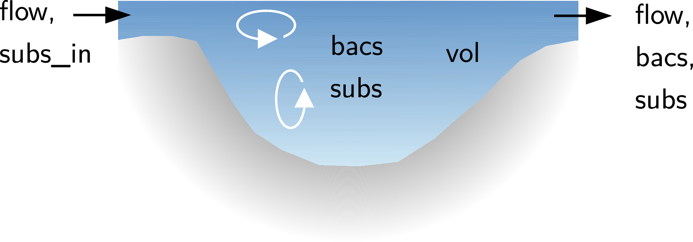

```{r, echo=FALSE}
library(rodeo)
library("captioner")
fig <- captioner(prefix="Fig.")
tab <- captioner(prefix="Tab.")
```

# Main features of `rodeo`

The `rodeo` package facilitates the implementation of ODE-based models in R. Such models describe the dynamics of a set of state variables by simultaneously integrating the corresponding differential equations. The package is particularly useful in conjunction with the R packages [`deSolve`](http://cran.r-project.org/package=deSolve) and [`rootSolve`](http://cran.r-project.org/package=rootSolve). The latter provide numerical solvers for initial-value problems and steady-state estimation. The advantages from using `rodeo` are:

- The model is formulated independent from source code to facilitate portability, re-usability, and documentation. Specifically, the model has to be set-up using the well-established [Peterson matrix notation](http://en.wikipedia.org/wiki/Petersen_matrix). All ingredients of a model (i. e. the ODE's right hand sides, declarations, and documentation) are in tabular form and they can be imported from delimited text files or spreadsheets.

- Owing to the matrix notation, redundant terms are largely eliminated from the differential equations. This contributes to comprehensibility and increases computational efficiency. The stoichiometry matrix can also be visualized to better communicate the model to other modelers or end users.

- `rodeo` provides a code generator which supports R and Fortran as target languages. Using compiled Fortran can speed up numerical integration by 1 or 2 orders of magnitude (compared to plain R).

- Code can be generated for an arbitrary number of computational boxes (e. g. control volumes in a spatially discretized model). This allows even partial differential equations (e. g. reactive transport problems) to be tackled after appropriate semi-discretization. The latter strategy is known as the [method-of-lines](http://en.wikipedia.org/wiki/Method_of_lines).

# Example ODE system

In the subsequent sections, the package's functioning is illustrated with simple model of bacteria growth in a continuous flow stirred tank reactor (figure below). It is assumed that the bacteria grow on a single resource (e. g. a source of organic carbon) which is imported via the reactor's inflow. Due to mixing, the reactors contents is spatially homogeneous, hence the density of bacteria as well as the concentration of the substrate are scalars.




Changes in bacteria density are due to (1) resource-limited growth and (2) wash-out from the reactor (inflow is assumed to be sterile). The substrate concentration is controlled by (1) the inflow as well as (2) the consumption by bacteria. A classical Monod term was used to model the resource dependency of bacteria growth. For the sake of simplicity, the external forcings (i. e. flow rate and substrate load) are held constant and the reactor's volume is a parameter rather than a state variable.

The governing differential equations are

$$ \frac{d}{d t}bacs = \color{blue}{mu * \frac{subs}{subs+half} * bacs} + \color{red}{\frac{flow}{vol}} * (0-bacs) $$

$$ \frac{d}{d t}subs = -\frac{1}{yield} * \color{blue}{mu * \frac{subs}{subs+half} * bacs} + \color{red}{\frac{flow}{vol}} * (subs_{in}-subs) $$


where redundant terms are displayed in identical colors (all identifiers are explained in tables below). For use with `rodeo`, the equations must be split up into a vector of process rates ($r$) and a matrix of stoichiometric factors ($S$) so that the product of the two yields the vector of the state variables' derivatives with respect to time ($\dot{y}$). Note that

$$
\dot{y} = r * S
$$

is the same as

$$
\dot{y} = S^T * r
$$

but in the first form, $\dot{y}$ is a row vector whereas it is a column vector in the second form which involves the transpose of $S$. Adopting the first form, the above set of ODE can be written as

$$
\begin{bmatrix} \dfrac{d}{d t}bacs , \dfrac{d}{d t}subs \end{bmatrix} =
\begin{bmatrix} mu * \dfrac{subs}{subs+half} * bacs \\ \dfrac{flow}{vol} \end{bmatrix} *
\begin{bmatrix} 1 & -bacs \\ -\dfrac{1}{yield} & subs_{in}-subs \end{bmatrix}
$$

The vector $r$ and the matrix $S$, together with a declaration of all identifiers appearing in the expressions, can conveniently be stored in tables, i.e. R data frames. Appropriate data frames are shipped with the package and can be loaded with the R function `data`. Their contents is displayed below:


```{r, echo=FALSE}
data(vars, pars, funs, pros, stoi)
knitr::kable(vars, caption="Data set `vars`: Declaration of state variables.")
knitr::kable(pars, caption="Data set `pars`: Declaration of parameters.")
knitr::kable(funs, caption="Data set `funs`: Declaration of functions referenced at the ODE's right hand sides.")
knitr::kable(pros, caption="Data set `pros`: Definition of process rates.")
knitr::kable(stoi, caption="Data set `stoi`: Definition of stoichiometric factors providing the relation between processes and state variables. Note the (optional) use of a tabular layout instead of the more common matrix layout.")
```

# Basic use

## Creating a `rodeo` model object

We start by loading packages and the example data tables whose contents was shown in the above Tables.

```{r loadExampleData, echo=TRUE}
library(deSolve)
library(rodeo)
data(vars, pars, pros, funs, stoi)
```

Then, a new object is created with the `new` method of the R6 class system. This requires us to supply the name of the class, data frames for initialization, as well as the spatial dimensions. Here, we create a single-box model (one dimension with no subdivision). contents. 

```{r initSingleBox, echo=TRUE}
model <- rodeo$new(vars=vars, pars=pars, funs=funs,
  pros=pros, stoi=stoi, dim=c(1))
```

To inspect the object's contents, we can use the following:

```{r inspectObject, echo=TRUE, eval=FALSE}
print(model)                   # Displays object members (output not shown)
print(model$stoichiometry())   # Shows stoichiometry as a matrix
```

## Defining functions and assigning data

In order to work with the object, we need to define functions that are referenced in the process rate expressions or stoichiometric factors (i. e. the ODEs' right hand sides). For non-autonomous models, this includes the definition of forcings which are functions of a special argument with the reserved name 'time' (details follow in a [separate section on forcings](#forcings)).

For the bacteria growth example, we only need to implement a simple [Monod function](https://en.wikipedia.org/wiki/Monod_equation).

```{r defNormalFunctions, echo=TRUE, eval=TRUE}
monod <- function(c, h) { c / (c + h) }
```

We also need to assign values to parameters and state variables (initial values) using the dedicated class methods `setPars` and `setVars`. Since we deal with a single-box model, parameters and initial values can be stored in ordinary *named* vectors.

```{r dataSingleBox, echo=TRUE, eval=TRUE}
model$setVars(c(bacs=0.01, subs=0))
model$setPars(c(mu=0.8, half=0.1, yield= 0.1, vol=1000, flow=50, subs_in=1))
```

## Computing the stoichiometry matrix

Having defined all functions and having set the values of variables and parameters, one can compute the stoichiometric factors. In general, explicitly computing these factors is not necessary, it may be helpful in debugging however. To do so, the `stoichiometry` class method needs to be supplied with the index of the spatial box (only relevant for multi-box models) as well as the time of interest (in the case of non-autonomous models).

```{r showNumericStoi, echo=TRUE, eval=TRUE}
m <- model$stoichiometry(box=1, time=0)
print(signif(m, 3))
```

The stoichiometry matrix is also a good means to communicate a model because it shows the interactions between processes and variables in a concise way. How the stoichiometry matrix can be visualized graphically is demonstrated in a [dedicated section](#visualizeStoichiometry) below.

## Generating source code for numerical solvers

In order to use the model for simulation, we need to generate source code to be passed to numerical solvers. Specifically, the generated function code shall return the derivatives of the state variables with respect to time plus additional diagnostic information (here: the process rates).

After generating the code, we need to make it executable. In R, we can use a combination of `eval` and `parse`. Alternatively, the generated code could be exported to a file using `write` and then loaded with `source`. The latter method allows for inspection of the generated code which may be helpful in debugging.

```{r generateSingleBoxR, echo=TRUE, eval=TRUE}
code <- model$generate(name="derivs",lang="r")
derivs <- eval(parse(text=code))
```

## Solving the ODE system

We are now ready to compute the evolution of the state variables over time by means of numerical integration. Note that the initial values (argument `y` of `deSolve::ode`) and parameters (argument `p`) are set to the output of the model object's `getVars` and `getPars` methods, respectively. This is to make sure that the order of values in the two arrays is consistent with the generated code.

```{r solveSingleBoxR, echo=TRUE, eval=FALSE, results='hide'}
out <- deSolve::ode(y=model$getVars(useNames=TRUE), times=0:96,
  func=derivs, parms=model$getPars())
colnames(out) <- c("time", model$namesVars(), model$namesPros())
layout(matrix(1:4, nrow=2, byrow=TRUE))
plot(out, mfrow=NULL)  # plot method for 'deSolve' objects
layout(1)
```

The graphical output of the above code is displayed below (top row: state variables, bottom row: process rates).

```{r ref.label='solveSingleBoxR', echo=FALSE, eval=TRUE}
```

# Advanced topics

## Multi-box models (spatial discretization)

A single-box model has been considered so far. We will now extend the model for multiple boxes, i. e. we model a set of reactors. To keep it simple, we consider just two boxes and we assume that the dynamics in the reactors is independent of each other (like in an experiment with two replicates).

First, we need to create a model object with the desired dimensions and resolution.

```{r ref.label='loadExampleData', echo=TRUE, eval=TRUE}
```
```{r initMultiBox, echo=TRUE, eval=TRUE}
nBox <- 2
model <- rodeo$new(vars=vars, pars=pars, funs=funs,
  pros=pros, stoi=stoi, dim=c(nBox))
```

 Second, the code needs to be re-generated to reflect the altered dimension.
 
```{r generateMultiBoxR, echo=TRUE, eval=TRUE}
code <- model$generate(name="derivs",lang="r")
derivs <- eval(parse(text=code))
```
```{r ref.label='defNormalFunctions', echo=TRUE, eval=TRUE}
```

 Third, initial values and parameters need to be specified as arrays (instead of vectors) to account for the spatial discretization. For a model with one spatial dimension, we must use two-dimensional arrays, i.~e. matrices. Here, we initialize every modeled reactor with a different bacteria density. The parameter values are identical for all reactors.
 
```{r dataMultiBox, echo=TRUE, eval=TRUE}
v <- cbind(bacs= seq(from=0.01, to=0.2, length.out=nBox), subs= rep(0, nBox))
model$setVars(v)
p <- c(mu=0.8, half=0.1, yield= 0.1, vol=1000, flow=50, subs_in=1)
p <- matrix(rep(p, each=nBox), nrow=nBox, dimnames=list(NULL, names(p)))
model$setPars(p)
```

Finally, the integration method is called as usual.

```{r solveMultiBoxR, echo=TRUE, eval=FALSE, results='hide'}
out <- ode(y=model$getVars(useNames=TRUE), times=0:96, func=derivs, parms=model$getPars())
layout(matrix(1:(model$lenVars()*nBox), nrow=nBox, byrow=TRUE))
plot(out, which=1:(model$lenVars()*nBox), mfrow=NULL)
layout(1)
```

In the graphical output of the above code, the state variables are organized in rows, and each column refers to a spatial box (see suffix in figure titles).

```{r ref.label='solveMultiBoxR', echo=FALSE, eval=TRUE}
```

## Maximizing performance through Fortran {#fortranGeneration}

As the number of simultaneous ODE increases and the right hand sides become more complex, computation times begin to matter. This is especially so in case of stiff systems of equations. In those time-critical cases, it is recommended to generate source code for a compilable language. The language supported by `rodeo` is Fortran. Fortran was chosen because of its superior array support (compared to C) and for compatibility with existing numerical libraries.

One could use the low-level method

```{r echo=TRUE, eval=FALSE}
code <- model$generate(name="derivs",lang="f95")    # not required for typical uses
```

to generate a function that computes the state variables' derivatives in Fortran. However, the interface of the generated function is optimized for universality. In order to use the generated code with the numerical solvers from [`deSolve`](http://cran.r-project.org/package=deSolve) or [`rootSolve`](http://cran.r-project.org/package=rootSolve), a specialized wrapper is required.

To make the use of Fortran as simple as possible, `rodeo` provides a high-level class method `compile` which  combines

1. generation of the basic Fortran code via the `generate` method (see above),

2. generation of the required wrapper for compatibility with `deSolve` and `rootSolve`,

3. compilation of all Fortran sources into a shared library (based on the command `R CMD SHLIB`)

```{r compileMultiBox, echo=TRUE, eval=FALSE}
lib <- model$compile(sources="fortran/functionsCode.f95")
```

The `compile` method takes as argument the name of a file holding the Fortran implementation of functions being referenced in the particular model's mathematical expressions. This argument can actually be a vector if the source code is split across several files. Consult the section on [Fortran functions](#fortranFunctions) for coding guidelines.

The return value of `compile` is a named vector of character strings holding the name of the generated shared library (in element `libName`), the full file path of the library (in element `libFile`) as well as the name of the callable subroutine within that library (in element `libFunc`). The library must be loaded and unloaded with `dyn.load` and `dyn.unload`, respectively.

A suitable Fortran implementation of the functions used in the example (contents of file 'fortran/functionsCode.f95') is shown below. Note that all the functions are collected in a single Fortran module with implicit typing turned off. The name of this module must be `'functions'` and it cannot be changed. Note that a Fortran module can import other modules which helps to structure more complex source codes. Also note that the user-supplied source files need to reside in directories with write-access to allow the creation of intermediate files during compilation.

```{r echo=FALSE, eval=TRUE, comment=''}
file_ffuns <- "fortran/functionsCode.f95"
text <- readLines(file_ffuns, n=-1L, ok=TRUE, warn=TRUE, encoding="unknown", skipNul=FALSE)
text <- paste(text,"\n")
cat(text)
```

The complete code to run the model from the previous section using Fortran-based code is given below. Note the additional arguments `dllname` and `nout` being passed to the numerical solver (for details consult the `deSolve` help page for method `lsoda`). It is especially important to pass the correct value to `nout`: In case of `rodeo`-based models, this must be the number of processes multiplied with the total number of boxes. Disregard of this may trigger segmentation faults that make R crash.

```{r ref.label='loadExampleData', echo=TRUE, eval=TRUE}
```
```{r ref.label='initMultiBox', echo=TRUE, eval=TRUE}
```
```{r ref.label='dataMultiBox', echo=TRUE, eval=TRUE}
```
```{r ref.label='compileMultiBox', echo=TRUE, eval=TRUE}
```
```{r solveMultiBoxF, echo=TRUE, eval=FALSE}
dyn.load(lib["libFile"])
out <- ode(y=model$getVars(useNames=TRUE), times=0:96,
  func=lib["libFunc"], parms=model$getPars(), dllname=lib["libName"],
  nout=model$lenPros()*prod(model$getDim()))
layout(matrix(1:(model$lenVars()*nBox), nrow=nBox, byrow=TRUE))
plot(out, which=1:(model$lenVars()*nBox), mfrow=NULL)
layout(1)
dyn.unload(lib["libFile"])
invisible(file.remove(lib["libFile"]))
```

The output of the above code is displayed below. It should be identical to the above output from the R-based code.

```{r ref.label='solveMultiBoxF', echo=FALSE, eval=TRUE}
```

## Forcing functions (time-varying parameters) {#forcings}

In general, there are two options for dealing with time-variable forcings:

**functions-of-time:** In this approach one needs to define the forcings as functions of a single argument representing time. In `rodeo` this argument must have the reserved name `time`. Use of this approach is most convenient if the forcings are easily described as parametric functions of time (e.g. seasonal change of solar radiation). It can also be used with tabulated time series data, but this requires some extra coding. In any case, it is essential for restrict the integration step size of the solver (e.g. using the `hmax` argument of `deSolve::lsoda`) so that short-term variations in the forcings cannot be 'missed'.
 
**stop-and-go:** In this approach forcings are implemented as normal parameters. To allow for their variation in time, the ODE solver is interrupted every time when the forcing data change. The solver is then re-started with the updated parameters (i.e. forcing data) using the states computed in the previous call as initial values. Hence, the calls to the ODE solver must be embedded within a time-loop. With this approach, setting a limit on the solver's integration step size (through argument `hmax`) is not required since the solver is interrupted at the 'critical times' anyway.

In real-world applications, the 'stop-and-go' approach is often simpler to use and the overhead due to interruption and re-start of the solvers seems to be rather small. It also facilitates the generation of useful traceback information in case of exceptions (e.g. due to corrupt time series data).

The remainder of this section demonstrates how the 'functions-of-time' approach can be used in Fortran-based models. It is  assumed that information on forcings is stored in delimited text files. Such files can be created, for example, with any spreadsheet software, data base system, or R. Assume that we have time series of two meteorological variables exported to a text file 'meteo.txt':

```{r echo=TRUE, eval=TRUE}
dat <- data.frame(time=1:10, temp=round(rnorm(n=10, mean=20, sd=3)),
  humid=round(runif(10)*100))
write.table(x=dat, file="tmp/meteo.txt", col.names=TRUE,
  row.names=FALSE, sep="\t", quote=FALSE)
print(dat)
```

In a purely R-based model, one would use `approxfun` to create the corresponding forcing function. In a Fortran-based model, we need to use the package's `forcingFunctions` method to generate an appropriate forcing function in Fortran. In the example below, linear interpolation is requested via the method's `mode` argument.

```{r echo=TRUE, eval=TRUE}
dat <- data.frame(name=c("temp","humid"),
  column=c("temp","humid"), file="tmp/meteo.txt", mode=-1, default=FALSE)
code <- forcingFunctions(dat)
write(x=code, file="tmp/forc.f95")
```

In order to use the generated code, it is necessary to

1. write it to disk (e.~g. using `write` as shown above),

2. declare all forcings as functions in `rodeo`'s respective input table,

3. insert the statement `use forcings` at the top (e.~g. line 2) of the Fortran module `'functions'`,

4. pass the generated file to the `compile` method along with all other Fortran source files.

The following Fortran code demonstrates how the user-defined forcings can be tested/debugged outside the `rodeo` environment. The shown utility program can be compiled, for example, using a command like

`gfortran <generated_module_file> <file_with_program> -o test`

Note that the subroutines `rwarn` and `rexit` are available automatically if a shared library is build with the `compile` class method (or directly with `R CMD SHLIB`), i. e. these subroutines must not be defined then.

```{r eval=TRUE, echo=FALSE, comment=''}
text <- readLines("fortran/fortranForcingsTest.f95", n=-1L, ok=TRUE, warn=TRUE, encoding="unknown", skipNul=FALSE)
text <- paste(text,"\n")
cat(text)
```

## Generating model documentation

### Exporting formatted tables

One can use e. g. the package's `exportDF` to export the object's basic information in a format which is suitable for inclusion in HTML or LaTeX documents. The code section

```{r exportTex, echo=TRUE, eval=FALSE}
# Select columns to export
df <- model$getVarsTable()[,c("tex","unit","description")]
# Define formatting functions
bold <- function(x){paste0("\\textbf{",x,"}")}
mathmode <- function(x) {paste0("$",x,"$")}
# Export
tex <- exportDF(x=df, tex=TRUE,
  colnames=c(tex="symbol"),
  funHead=setNames(replicate(ncol(df),bold),names(df)),
  funCell=list(tex=mathmode)
)
cat(tex)
```

generates the following LaTeX code

```{r ref.label='exportTex', echo=FALSE, eval=TRUE, comment=''}
```

holding tabular information on the model's state variables. To include the result in a document one needs to write the generated LaTeX code to a file for import with either the `input` or `include` directive. Things are even simpler if the Sweave pre-processor is used which allows the above R code to be embedded in LaTeX directly between the special markers `<<echo=FALSE, results=tex>>=` and `@`.

Alternatively, a markdown compatible version can be generated and used with the `kable` function from the `knitr` package. This will work with html, pdf or word processor formats. The following code section to create a table of the model's state variables

```{r exportMarkdown, echo=TRUE, eval=FALSE}
knitr::kable(model$getVarsTable()[,c("name","unit","description")])
```

produces the result below.

```{r ref.label='exportMarkdown', echo=FALSE, eval=TRUE, comment=''}
```

### Visualizing the stoichiometry matrix {#visualizeStoichiometry}

A graphical representation of the stoichiometry matrix is often a good means to communicate a model. To create such a graphics, one typically wants to replace the stoichiometry factors' numeric values by symbols encoding their sign only.

#### Plain R graphics
One can use the class method `plotStoichiometry` to visualize the matrix using standard R graphics as demonstrated below. This creates a matrix of triangle symbols where the orientation indicates whether the value of a state variable increases (upward) or decreases (downward) due to the action of a particular process.

```{r plotStoichiometry, echo=TRUE, eval=FALSE}
model$plotStoichiometry(box=1, time=0, cex=0.8)
```
```{r echo=FALSE, eval=TRUE}
omar <- par("mar")
par(mar=c(0,4,4,0))
```
```{r ref.label='plotStoichiometry', echo=FALSE, eval=TRUE, fig.width=2, fig.height=2.5}
```
```{r echo=FALSE, eval=TRUE}
par(mar=omar)
```

In practice, one needs to fiddle around a bit with the dimensions of the plot and the font size to get an acceptable scaling of symbols and text. Also, it is hardly possible to nicely display row and column names containing special formatting like sub- or superscripts.


#### LaTeX documents
The following example generates suitable LaTeX code to display a symbolic stoichiometry matrix (as a table, not a graphics).

```{r echo=TRUE, eval=TRUE}
signsymbol <- function(x) {
  if (as.numeric(x) > 0) return("\\textcolor{red}{$\\blacktriangle$}")
  if (as.numeric(x) < 0) return("\\textcolor{blue}{$\\blacktriangledown$}")
  return("")
}
rot90 <- function(x) { paste0("\\rotatebox{90}
  {$",gsub(pattern="*", replacement="\\cdot ", x=x, fixed=TRUE),"$}") }
m <- model$stoichiometry(box=1, time=0)
tbl <- cbind(data.frame(process=rownames(m), stringsAsFactors=FALSE),
  as.data.frame(m))
tex <- exportDF(x=tbl, tex=TRUE,
  colnames= setNames(c("",model$getVarsTable()$tex[match(colnames(m),
    model$getVarsTable()$name)]), names(tbl)),
  funHead= setNames(replicate(ncol(m),rot90), colnames(m)),
  funCell= setNames(replicate(ncol(m),signsymbol), colnames(m)),
  lines=TRUE
)
tex <- paste0("%\n% THIS IS A GENERATED FILE\n%\n", tex)
# write(tex, file="stoichiometry.tex")
```

The contents of the variable `tex` must be written to a text file and this file can then be imported in LaTeX with the `input` directive.

#### HTML documents

The following example generates suitable code for inclusion in HTML documents.

```{r echo=TRUE, eval=TRUE}
signsymbol <- function(x) {
  if (as.numeric(x) > 0) return("&#9651;")
  if (as.numeric(x) < 0) return("&#9661;")
  return("")
}
m <- model$stoichiometry(box=1, time=0)
tbl <- cbind(data.frame(process=rownames(m), stringsAsFactors=FALSE),
  as.data.frame(m))
html <- exportDF(x=tbl, tex=FALSE,
  colnames= setNames(c("Process",model$getVarsTable()$html[match(colnames(m),
    model$getVarsTable()$name)]), names(tbl)),
  funCell= setNames(replicate(ncol(m),signsymbol), colnames(m))
)
html <- paste("<html>", html, "</html>", sep="\n")
# write(html, file="stoichiometry.html")
```

To test this, one needs to write the contents of the variable `html` to a text file and open that file in a web browser. In some cases, automatic conversion of the generated HTML into true graphics formats may be possible, e. g. using auxiliary (Linux) tools like 'html2ps' and 'convert'.

#### Markdown documents

A markdown compatible version can be generated with the `kable`function from package `knitr`.

```{r stoiMarkdown, echo=TRUE, eval=FALSE}
signsymbol <- function(x) {
  if (as.numeric(x) > 0) return("$\\color{red}{\\blacktriangle}$")
  if (as.numeric(x) < 0) return("$\\color{blue}{\\blacktriangledown}$")
  return("")
}
m <- model$stoichiometry(box=1, time=0)
m <- apply(m, MARGIN = c(1, 2), signsymbol)
knitr::kable(m)
```

```{r ref.label='stoiMarkdown', echo=FALSE, eval=TRUE}
```

# Practical issues

## Managing tabular input data

`rodeo`'s tabular input data are typically held in either plain text files or spreadsheets. The two alternatives have their own pros and cons summarized in the table below.

```{r echo=FALSE}
x <- rbind(
 c("Portability across programs and operating systems", "+", "(-)"),
 c("Suitability for version control", "+", "-"),
 c("Editing with regular expressions", "+", "-"),
 c("Syntax highlight", "+", "-"),
 c("Display with proper alignment", "-", "+")  
)
colnames(x) <- c("Feature","Delimited text","Spreadsheet")
knitr::kable(as.data.frame(x))
```

Practice has shown that it is a good compromise to store the tabular data in delimited text files and to open them either in a spreadsheet program or editor, depending on the particular task. Note that the conventional 'csv' format is not recommended since mathematical expressions involving multi-argument functions and text descriptions may contain commas (hence, they need to be quoted). Using TAB-delimited text is probably the best option. It can be copied-and-pasted between text and spreadsheet files. Modern editors can highlight TAB-characters making them distinguishable from ordinary blanks.

## Writing `rodeo`-compatible Fortran functions {#fortranFunctions}

### Reference example

As a reference, the following Fortran code can be used (after deletion of line numbers). The code declares a function of two arguments. All identifiers are in uppercase letters just for clarification. Comments have been added to briefly explain the individual statements. In Fortran, comments start with an exclamation mark.

```{}
1  double precision function FUNCNAME (ARG1, ARG2) ! declare the function
2  implicit none                                   ! force type declarations
3  double precision, intent(in):: ARG1, ARG2       ! declare arguments
4  double precision:: LOCAL                        ! declare local variable
5  double precision, parameter:: CONST=1.d0        ! declare local constant
6  LOCAL= ARG1 * CONST + ARG2                      ! local computation(s)
7  FUNCNAME= LOCAL                                 ! set return value
8  end function                                    ! closes the function
```

For compatibility with `rodeo`, the function result must be a scalar of type `double precision` (a floating point number of typically 8 byte). There are several ways to achieve this but the simplest and recommended syntax is put the type declaration `double precision` right before the function's name (line 1). Then, the return value must be set by an assignment to the function's name (line 7). This is best done at a single location in the body code, typically at the very end.

It is a good habit to always put `implicit none` in the first line of the function body (line 2). This is to disable 'implicit typing' which is a rather dangerous automatism of data type assignment. With this statement, all arguments (line 3) and any local variables or constants (lines 4 and 5) need to be explicitly declared. As opposed to C or C++, data types of formal arguments cannot be declared in the function interface (line 1), making it necessary to waste some extra lines (line 3). All declarations need to be made at the top of the function's body right after the `implicit none`.

In `Fortran`, identifier names are not case-sensitive (as opposed to R). This applies to the name of the function itself as well as to the names of arguments and local variables or parameters. Using uppercase names for constants is a widespread habit.

Note: It is actually sufficient to put a single `implicit none` statement at the beginning of the module `'functions'` (see example in the above section on [Fortran code generation](#fortranGeneration)). Repetition of `implicit none` statements in the individual functions don't do any harm, however. 

### Common Fortran pitfalls

#### Double precision constants

Fortran has several types to represent floating point numbers that vary in precision but `rodeo` generally uses the type `double precision`. Thus, any local variables and parameters should also be declared as `double precision`. To declare a *constant* of this type, e. g. 'pi', one needs to use the special syntax `3.1415d0`, i.e. the conventional 'e' in scientific notation must be replaced by 'd'. Do **not** use the alternative syntax `3.1415_8` as it is not portable. Some further examples are shown below. Note the use of the `parameter` keyword informing the compiler that the declared items are constants rather than variables.

```{}
double precision, parameter:: pi= 3.1415d0, e= 2.7183d0   ! math constants 
double precision, parameter:: kilograms_per_gram = 1.d-3  ! 1/1000
double precision, parameter:: distance_to_moon = 3.844d+5 ! 384400 km
```

#### Integers in numeric expressions

It is recommended to avoid integers in arithmetic expressions as the result may be unexpected. Use `double precision` constants instead of `integer` constants or, alternatively, explicitly convert types by means of the `dble` intrinsic function.

```{}
average= (value1 + value2) / 2d0       ! does not use an integer at all
average= (value1 + value2) / dble(2)   ! explicit type conversion
```

It is often even better not to use any literal constants, leading to a code like

```{}
double precision, parameter:: TWO= 2.d0
! ... possibly other statements ...
average= (value1 + value2) / TWO
```

#### Long Fortran statements (continuation lines)

Source code lines should not exceed 80 characters (though some Fortran compilers support longer lines). If an expression does not fit on a single line, the ampersand (`&`) must be used to indicate continuation lines. Missing `&` characters are a frequent cause of compile time errors and the respective diagnostic messages are sometimes rather obscure. It is recommended to put the `&` at the end of any unfinished line as in the following example:

```{}
a = term1 + term2 + &
    term3 + term4 + &
    term5
```

### More information on Fortran

The examples given in the section on [Fortran code generation](#fortranGeneration) may serve as a starting point. The [Fortran wiki](http://fortranwiki.org/fortran/show/HomePage) is a good source of additional information, providing links to standard documents, books, etc.
